# Hyprland

大多数的配置都是通过修改 hyprland 的配置文件~/.config/hypr/hyprland.conf实现的  

可以用模块化的思想，将动画，窗口规则，绑定键位等设置独立出一个文件，并将各种值在一个文件中声明变量初始化并调用

## 设置命令开机自启动

进入该配置文件，在 exec-once 开头的那一块区域写入  

```
exec-once=需要开机自动执行的命令  
```

比如我在使用mpvpaper 这个视频壁纸项目  
我就把它提供的设置播放视频壁纸的命令写进了配置文件里设置开机自启  

```
exec-once=mpvpaper -o "--loop-file" eDP-1 Downloads/【哲风壁纸】剪影-多重影像.mp4 &  
```

其实这个写哪里应该是无所谓，但还是美观一些吧  

## 设置快捷键

也是在这个配置文件里修改  
关键字是 bind 开头的行  

```
$mainMod = SUPER # Sets "Windows" key as main modifier
$control = ctrl # by myself

#by myself
bind = $control, t, exec, $terminal
bind = $mainMod, F2,exec,pkill waybar || true && waybar #restart waybar  

# Example binds, see https://wiki.hypr.land/Configuring/Binds/ for more

#bind = $mainMod, T, exec, $terminal
bind = $mainMod, C, killactive,
bind = $mainMod, M, exit,
bind = $mainMod, E, exec, $fileManager
bind = $mainMod, V, togglefloating,
bind = $mainMod, R, exec, $menu
bind = $mainMod, P, pseudo, # dwindle
bind = $mainMod, J, togglesplit, # dwindle

```

可以看到，这个快捷键设置其实就是自定义变量的值为某个键位，然后在 bind 里引用该变量并与其他变量和键位组合使用（后续使用发现一些常见键位并不需要赋值给变量，比如 CTRL 、SHIFT、F10 之类的直接写也能识别）  

比如我自定义的 ctrl + t 打开 konsole（$terminal 也在这个配置文件里修改，默认是 kitty，我改成 konsole 了）  
然后在 bind 里引用该变量  

```
$control = ctrl
bind = $control, t, exec, $terminal  
```

另一个是重启任务栏waybar 的快捷键，我设置成了 super + F2,命令逻辑比较简单就不解释了  

这个配置文件还有很多功能，环境变量之类的我还没用到  

```
$terminal = konsole  
$fileManager = thunar  
$menu = fuzzel  
```

这三个变量，终端，文件管理器，菜单都被我改成这些了，因为默认的不太习惯,当然修改之前对应的包都要装上


关于桌面快捷键的事，虽然配置文件的 bind 的注释里都写清楚用途，但我还是记录一下常用的默认配置和我的自定义的快捷键配置  

```
super + e				打开 thunar 文件管理器
super + c				关闭当前窗口
super + 数字键		    切换到指定数字的工作区
super + v				切换窗口状态，在浮动和平铺状态中切换
super + r				打开应用列表
super + 左键拖动	     	移动窗口（当窗口处于平铺状态时）
super + 右键拖动		    拉伸窗口（当窗口处于平铺状态时）
super + 鼠标滚轮		    快捷切换工作区
super + q				关闭 waybar
super + F2			    重启 waybar
super + s				快速最小化当前桌面窗口，再次使用就会回来
```

关于这个 super + s 快捷键，我是这样理解的，所有的工作区都是桌面的不同区域，而 super s 则是把当前使用的桌面上的所有窗口收进下面的抽屉里，再次按下就会当前使用的桌面上展开，也就是从抽屉里拿出来放上  

hyprland 自己也有 wiki，肯定是比 archwiki 在这方面更详细的，可以多看看  
[https://wiki.hypr.land/](https://wiki.hypr.land/)  

## 剪切板方案
安装需要的软件

```
sudo pacman -S --needed wl-clipboard  
yay -S cliphist  
```

然后在 hyprland 配置文件里写入  如下内容

```
exec-once = wl-paste --type text --watch cliphist store # Stores only text data
exec-once = wl-paste --type image --watch cliphist store # Stores only image data

#绑定调用剪切板的快捷键
bind = $mainMod, x, exec, cliphist list | fuzzel --dmenu --with-nth 2 | cliphist decode | wl-copy

#如果用的文件管理器是 fuzzel 的话
```

如果是其他文件管理器，对应的键位绑定配置就去看 hyprland 的 wiki [https://wiki.hypr.land/Useful-Utilities/Clipboard-Managers/](https://wiki.hypr.land/Useful-Utilities/Clipboard-Managers/)  
  
  

## 截图录屏方案

安装这三个包  

```
sudo pacman -S grim slurp wf-recorder
```

然后在 hyprland 配置文件里绑定快捷键  

```

# 区域截图：同时保存到图片目录和剪贴板
bind = $mainMod SHIFT, S, exec, grim -g "$(slurp)" | tee ~/Pictures/screenshot_$(date +%Y%m%d_%H%M%S).png | wl-copy

# 全屏截图：同时保存到图片目录和剪贴板  
bind = $mainMod,q,exec, grim | tee ~/Pictures/screenshot_$(date +%Y%m%d_%H%M%S).png | wl-copy

# 录屏快捷键  
bind = $mainMod SHIFT, v, exec, wf-recorder -g "$(slurp)" -f "$HOME/Videos/recording_$(date +%Y%m%d_%H%M%S).mp4"
bind = $mainMod CTRL, v, exec, pkill -SIGINT wf-recorder  # 停止录制

```

## waybar 美化

参考的别人的美化风格，整体配置比较模块化，总体文件结构如图  

  

一个个介绍吧  

```
center-test.jsonc 
是我用来临时检测我的 arch 图标有没有居中，用 waybar -c ~/.config/waybar/center-test.jsonc 测试，会在当前的 bar 下面再显示出一个临时的居中 arch 图标，以此来检测上面的 arch 图标有没有居中  

colors.css 
用于声明各种颜色变量以供调用  
关于这个，konsole 支持鼠标指针放颜色代码上去可以预览颜色，很方便我修改  

config.jsonc 
是整体框架，模块定义在别的文件里写  

modules-dividers.jsonc 
定义了各种图形，用于不同模块之间的图形衔接，在 css 中具体调色  

modules.jsonc
里是各种模块的定义，注释已经很清楚了  

style.css 
包含了模块和连接符的美化  
比如custom/left_div#9 连接符，它的左右颜色是根据 color 和 background-color 决定的  

script 里面都是模块调用的脚本  
scripts/cava.sh 
音频可视化调用的脚本文件 

metadata.sh 
辅助音频可视化，实现悬停显示正在播放的音频名称

get-clock.sh 
就是简单的悬停获取时间的脚本， 时钟模块调用的  

下面两个是截屏调用的脚本，因为脚本在 hyprland 快捷键里早就有使用，所以我就拿来复用了  
screenshot_edit.sh
screenshot_quick.sh

set_wallpaper.sh 
快捷切换壁纸脚本，和下面的脚本结合使用

wallpaper_scroll.sh  
壁纸目录应当存放在$HOME/Pictures/anime/wallpapers 下  

wf-recorder.sh
录屏菜单脚本

switch-audio-output.sh 
快捷选择音频输出设备  
```

桌面美化效果预览如下  

  

有个小瑕疵，就是那个控制息屏的模块，它的两个状态切换的图标大小是不一样的，当前是启用息屏，中间的图标正好居中，我切换到另一个状态，图标就小了一点，中间的图标就会往左移动一些，但我也懒得改了，不过修改也简单，改成大小一致的图标就行，但我还没找到合适的，另一个方案是用 css 的 padding 字段，严格控制该字符的边距就行了，但我暂时也不改了  

这段配置，算是能用吧，至少作为 hyprland 的 bar 是可以的，但还是有待优化，代码逻辑有的就有效率问题，比如滚动切换壁纸使用 pkill 是很浪费性能的，明明 mpvpaper 就支持直接覆盖，不过还是等后续修改吧  


## 禁用触控板

使用hyprctl devices 命令查看设备  

```bash
❯ hyprctl devices                                                  
mice:
Mouse at 55abfcd826a0:
rapoo-rapoo-gaming-device
default speed: 0.00000
scroll factor: -1.00
Mouse at 55abfde531e0:
rapoo-rapoo-gaming-device-keyboard-1
default speed: 0.00000
scroll factor: -1.00
Mouse at 55abfde52e30:
asuf1204:00-2808:0202-mouse
default speed: 0.00000
scroll factor: -1.00
Mouse at 55abfe365130:
asuf1204:00-2808:0202-touchpad
default speed: 0.00000
scroll factor: -1.00


```

可以看到触控板设备名为asuf1204:00-2808:0202-touchpad  

```
hyprctl keyword 'device[asuf1204:00-2808:0202-touchpad]:enabled' 'false'
```

这条命令可以关闭触控板，设置为 true 就打开  
那就可以写个 shell 脚本再通过 bind 绑定键位  

编辑文件

```
vim ~/.config/hypr/scripts/toggle_touchpad.sh 
```

写入如下内容

```bash

#!/usr/bin/env bash
DEVICE_TOUCHPAD="asuf1204:00-2808:0202-touchpad"

STATE_FILE="/tmp/hypr_touchpad.state"

if [ -f "$STATE_FILE" ]; then
    hyprctl keyword "device[$DEVICE_TOUCHPAD]:enabled" 'true'
    
    notify-send "Touchpad" "已启用 ✅" -u low
    rm "$STATE_FILE"
else
    hyprctl keyword "device[$DEVICE_TOUCHPAD]:enabled" 'false'
    
    notify-send "Touchpad" "已禁用 ⛔" -u low
    touch "$STATE_FILE"
fi


```

加上执行权限  

```
sudo chmod +x ~/.config/hypr/scripts/toggle_touchpad.sh  
```

在 hyprland 配置文件上绑定键位 ctrl+f10  

```bash
bind = CTRL, F10, exec, ~/.config/hypr/scripts/toggle_touchpad.sh
```

## 浮动窗口间隙设置

在使用时注意到我的 waybar 和浮动窗口之间有一段空白，不太美观  
这个空白大小是可以修改的，还是在那个 hyprland 配置文件里  

```bash
# https://wiki.hypr.land/Configuring/Variables/#general
general {
    gaps_in = 5
    gaps_out = 0,10,10,10
    就是gaps_out这个变量，它可以设定浮动窗口四周的空白保留区域的像素大小，只设定一个值就是只保
留上部分区域的空白像素大小，多个值就要之间加上逗号    
    border_size = 2

    # https://wiki.hypr.land/Configuring/Variables/#variable-types for info about colors
    col.active_border = rgba(33ccffee) rgba(00ff99ee) 45deg
    col.inactive_border = rgba(595959aa)

    # Set to true enable resizing windows by clicking and dragging on borders and gaps
    resize_on_border = false

    # Please see https://wiki.hypr.land/Configuring/Tearing/ before you turn this on
    allow_tearing = false

    layout = dwindle
}


```

这个变量同样可以在 hyprland 的 wiki 里查到，还是吃了英语不好的亏  

本来想把四周全设置 0 的，但我又想想，没有四周留白和平铺模式有啥区别，那不就成了不能动的窗口吗？所以我故意除了顶部全都设置了10像素的留白空间，这样才知道我用的是浮动窗口模式（其实平铺模式会和 waybar 重叠，通过这个也能看出来😅）  

## 视频壁纸方案

项目名 mpvpaper  

项目地址 [https://github.com/GhostNaN/mpvpaper](https://github.com/GhostNaN/mpvpaper)  
这个项目要求三个前置软件包  

```
sudo pacman -S --needed ninja meson mpv  
```

然后克隆构建和安装  

```

git clone --single-branch [https://github.com/GhostNaN/mpvpaper](https://github.com/GhostNaN/mpvpaper)
cd mpvpaper
meson setup build --prefix=/usr/local
ninja -C build
ninja -C build install

```

使用方法  

```
mpvpaper DP-2 /path/to/video  
```

DP-2 是显示器名字，也就是说可以指定显示器播放，自己的显示器名字用 hyprctl monitors all查看所有 hyprland 检测到的显示器信息，懒得看就直接用 ALL 代替所有显示器  

笔记本内置屏幕名字一般是 eDP-1,我的就是  
但这个只能播放一次，需要循环播放就需要使用命令  
例如这样的  

```
mpvpaper -o "--loop-file" eDP-1 Downloads/【哲风壁纸】剪影-多重影像.mp4  
```

这个命令是前台运行，所以可以在尾巴加上&，但是这样关闭终端就会杀死进程，另一种方法是加上& disown，这样即使关闭终端也不会杀死进程，不过如果要写进 exec-once 里只需要单用一个&就足够了  

```
mpvpaper -o "--loop-file" eDP-1 Downloads/【哲风壁纸】剪影-多重影像.mp4 &  
```

这个命令就可以写进 hyprland 的 exec-once 设置开机自启  

值得一提的是，视频壁纸作为layer被hyprland的规则匹配到，那么我就可以通过hyprland的动画规则实现视频壁纸切换的动画效果，然而前端切换工具waypaper调用waypaper的方法是先杀进程后切换，这样就会导致切换过程不可避免的闪一下，很不美观，我们可以通过改变waypaper调用mpvpaper的规则，改成下一个壁纸切换时，直接覆盖当前壁纸（mpvpaper支持这么做），然后再杀掉上一个壁纸的进程，这样就能展示出mpvpaper的简单切换过程动画效果
  

## 截屏翻译方案

主要使用 Crow Translate 这个程序  
1.安装主程序  

```
yay -S crow-translate  
```

2.安装 Wayland/OCR 核心依赖  
tesseract 是引擎, slurp 是划词工具, portal 是 Wayland 门户  

```
sudo pacman -S tesseract slurp xdg-desktop-portal-hyprland  
```


3.安装 OCR 语言包  
我玩未来战用的，就装英韩中三个语言吧  

```
sudo pacman -S tesseract-data-eng tesseract-data-kor tesseract-data-chi_sim  
```


打开软件Crow Translate  
点右下角三个横线进入这个界面的这个设置  
  
把安装的 OCR 语言包都勾选上  

再到这个选项  
  

点一下最右边的按钮 Detect fastest  
URL 里面是翻译引擎，默认的早就失效了，需要按这个按钮刷新出新翻译引擎，不然用旧的会在翻译栏报 418 错误  

目前只能在程序主界面点击截图才能截图翻译，关于快捷键截图翻译，关于全局的那一片是灰色的不能用，目前猜测是因为我的 plasma 和 hyprland 的混合桌面环境导致的，也有可能是因为 hyprland 禁止绕过它配置快捷键，反正目前还不知道为啥，有待后续排查（我也懒得排查这玩意，不如多找找别的开源项目，排不排查再说吧）  

  

另外在安装过程中，有个注意事项，不能在包管理器 pacman 工作的时候后台跑游戏，尤其是 steam 游戏，不然 hyprland 会卡死，忘记是为啥了，反正最好别这样搞  

# Waydroid

## Waydroid 初始配置

安装 waydroid 并初始化  

```
sudo pacman -S waydroid  
sudo waydroid init  
```

//如果需要使用谷歌服务，可以指定带有谷歌服务的镜像  

```
sudo waydroid init -s GAPPS  
```


原生 Waydroid 是 x86 架构的，想使用 arm 架构应用比如安装运行 apk 需要安装翻译层  
安装waydroid-script  

```
yay -S waydroid-script-git  
```

waydroid-scripts 项目提供了 waydroid-extras 命令来安装翻译层,   libhoudini 用于英特尔,libndk 用于 AMD  

不过在某些程序无法运行时，两个都可以装上试试看  
我是 A 卡  

```
sudo waydroid-extras 
```

跟着提示一步步走选择安装libndk就行了  

使用谷歌商店会出现此设备不能安装的情况，需要将设备 id 加入谷歌设备中  
这个项目同样提供了获取设备 id 和提供添加 id 的谷歌官网链接，也在 waydroid-extras 命令中  

后面发现了 waydroid 轮椅级别的服务工具，功能很全，貌似已经覆盖了上面的工具的所有功能，还是图形化的，叫waydroid-helper，可以用 pacman 直接安装  

## Waydroid 画面撕裂问题

具体表现形式是类似花屏和撕裂，不过只有黑色色调  

还是混合显卡的问题，是 waydroid 默认使用显卡和桌面环境使用的显卡不一致导致的，我的 plasma 桌面环境默认使用 N 卡（可以用watch -n 1 nvidia-smi 查看哪些进程在使用 N 卡，每秒实时刷新），waydroid 在使用 A 卡集显，需要切换 waydroid 的显卡使用策略，为此 GitHub 上有个项目提供解决方案脚本  

[https://github.com/Quackdoc/waydroid-scripts/](https://github.com/Quackdoc/waydroid-scripts/blob/main/waydroid-choose-gpu.sh)  

这个链接  

脚本内容是  

```bash
❯ cat waydroid-scripts/waydroid-choose-gpu.sh  

#!/usr/bin/env bash
set -eo pipefail

lspci="$(lspci -nn | grep '\[03')" # https://pci-ids.ucw.cz/read/PD/03

echo -e "Please enter the GPU number you want to pass to WayDroid:\n"
gpus=()
i=0
while IFS= read lspci; do
gpus+=("$lspci")
echo "  $((++i)). $lspci"
done < <(echo "$lspci")
echo ""
while [ -z "$gpuchoice" ]; do
read -erp ">> Number of GPU to pass to WayDroid (1-${#gpus[@]}): " ans
if [[ "$ans" =~ [0-9]+ && $ans -ge 1 && $ans -le ${#gpus[@]} ]]; then
gpuchoice="${gpus[$((ans-1))]%% *}" # e.g. "26:00.0"
fi
done

echo ""
echo "Confirm that these belong to your GPU:"
echo ""

ls -l /dev/dri/by-path/ | grep -i $gpuchoice

echo ""

card=$(ls -l /dev/dri/by-path/ | grep -i $gpuchoice | grep -o "card[0-9]")
rendernode=$(ls -l /dev/dri/by-path/ | grep -i $gpuchoice | grep -o "renderD[1-9][1-9][1-9]")

echo /dev/dri/$card
echo /dev/dri/$rendernode

cp /var/lib/waydroid/lxc/waydroid/config_nodes /var/lib/waydroid/lxc/waydroid/config_nodes_$(date +
%Y-%m-%d-%H:%M).bak
cp /var/lib/waydroid/waydroid.cfg /var/lib/waydroid/waydroid.cfg_$(date +%Y-%m-%d-%H:%M).bak

#lxc.mount.entry = /dev/dri dev/dri none bind,create=dir,optional 0 0
sed -i '/drm_device/d' /var/lib/waydroid/waydroid.cfg
sed -i "/^\[waydroid\]/a drm_device = /dev/dri/$rendernode" /var/lib/waydroid/waydroid.cfg
waydroid upgrade --offline

```

## waydroid 按键映射

之前无法解决 waydroid 没有滑动映射的问题，在 github 上看到了一个项目，还算能用，  

项目地址：[https://github.com/waydroid-helper/waydroid-helper/tree/main](https://github.com/waydroid-helper/waydroid-helper/tree/main)  

对于 archlinux 用户，直接从 aur 仓库安装即可  

```
yay -S waydroid-helper  
```

这个应用功能比较齐全了，值得一提的是，在设置按键映射时，会出现一个窗口，然后在窗口里设置映射键位，这里并不是说明上说的，把映射键位放在对应按键上就行，而是根据这个窗口与 waydroid 的缩放比例，放到对应的位置，要使用映射时，需要先鼠标聚焦到映射的窗口  

类似这样，我映射了游戏的方向键，因为这个 b 游戏的方向键只支持滑动操作，可以看到，我的方向键在窗口中的位置是等比例缩小游戏窗口和方向键的对应位置，我需要使用映射时必须把鼠标聚焦到左下角的映射窗口  

  

这个助手还提供其他功能，比如伪装成指定机型，获取设备 id，之类的常见需求  


# archlinux配置安全启动

## 理论基础

一、 什么是安全启动？  
安全启动 (Secure Boot)是主板 UEFI 固件里的一项安全功能。  

它的唯一目的是在操作系统（Arch / Windows）启动之前，阻止任何“不受信任”的代码运行。这主要是为了防御在开机阶段就加载的恶意软件（如 Rootkit）。  

理论依据：它的工作原理非常简单：UEFI 固中内置了一个“可信签名数据库”。当你开机时，UEFI 会像个“保安”一样，检查要加载的第一个启动文件（Bootloader）有没有“可信的签名”。  
默认情况下，UEFI 只信任一个签名：微软 (Microsoft) 的。  

如果启动文件（比如 `grubx664.efi`）没有微软签名，UEFI 会拒绝加载它，启动过程当场中止。  


二、 Arch Linux 的解决方案  

整套方案，核心理论就是**“信任接力”。我们利用一个微软信任的程序，来“引荐”我们自己的程序  
`shimx64.efi` 是一个由微软官方签名的小型引导程序,它有微软签名，所以“保安”(UEFI) 会允许它启动,shim 启动后的唯一任务，就是去加载下一个程序（也就是我们的 GRUB）。  


MOK (我们自己的“签名”)  
MOK (Machine Owner Key) 是我们自己创建的一对“签名密钥”（公钥/私钥）。  
`shim` 也不是什么都加载。它只会加载那些被“它信任的密钥”签过的文件。  
我们把 MOK 的“公钥”注册（Enroll）到主板里，`shim` 就会“认识”它。从此，`shim` 就会信任任何被我们 MOK“私钥”签过的文件。  
总结：`UEFI(信任) -> 微软(签名) -> shim(信任) -> MOK(签名) -> 我们的GRUB`。这条信任链就通了。  


独立的 GRUB  
信任链是通了，但 `shim` 只会验证 `grubx64.efi` 这一个文件。但常规的 GRUB 启动时，需要从磁盘上读取几十个零散的模块（比如 `fat.mod`, `btrfs.mod`）和配置文件 (`grub.cfg`)。`shim` 无法验证这几十个文件。  
解决方案：我们不能用常规的 GRUB。我们必须用 `grub-mkimage` 命令，手动创建一个“独立自主”的 `grubx64.efi`。  
理论：  
打包模块:  
我们把所有未来可能用到的驱动模块（`fat`, `part_gpt`, `btrfs` 等）提前打包并嵌入到 `grubx64.efi`文件内部。  

硬编码配置：  
我们把一个迷你的“启动脚本”（即 `grub-pre.cfg`）也硬编码进 `grubx64.efi` 的“大脑”里。  
这个“大脑”（`grub-pre.cfg`）的唯一任务，就是加载它“后备箱”里打包的正确驱动（比如 `insmod fat`），然后用正确的路径（比如 `set prefix=($root)/grub`），去找到那个真正的菜单 (`grub.cfg`)。  


`pacman` 钩子  
这个信任链必须全程维护。`grubx64.efi` 需要 MOK 签名，`vmlinuz-linux` (内核) 也同样需要 MOK 签名。  
pacman -Syu` 会用未签名的新内核覆盖掉旧的已签名内核。  
`pacman` 钩子 (Hook) 是一个自动化脚本。它在更新后，立即自动重签。  
内核钩子：  
监视 `linux-zen` 包。一旦更新，立刻自动运行 `sbsign` 命令，用你的 MOK 私钥给新的 `vmlinuz-linux-zen` 签名。  

GRUB 钩子：  
监视 `grub` 包。一旦更新，立刻自动运行 `update-sb-grub-efi.sh`，重新生成那个“独立管家” `grubx64.efi` 并自动签名。  

总结成一句话： 我们利用微软签名的 `shim`，来加载一个我们自己 MOK 签名的、内置了驱动和路径（`insmod fat`）的独立`grubx664.efi`，这个 `grub` 再去加载同样被 MOK 签名的内核，最后用 `pacman` 钩子让这个签名过程自动化。  

## 配置过程

### 1.GRUB 侧的配置

首先，安装相应的软件包：shim-signed（AUR 包），sbsigntools，mokutil。  

使用 OpenSSL 生成一对安全启动签名密钥，记得妥善保管。  

```bash
sudo mkdir /etc/secureboot/keys

# Generate key pair
KEYPAIR_PATH='/etc/secureboot/keys'
sudo openssl req -newkey rsa:4096 -nodes -keyout "$KEYPAIR_PATH/MOK.key" -new -x509 -sha256 -days 3650 -subj "/CN=My Arch Linux Machine Owner Key/" -out "$KEYPAIR_PATH/MOK.crt"
sudo openssl x509 -outform DER -in "$KEYPAIR_PATH/MOK.crt" -out "$KEYPAIR_PATH/MOK.cer"

```

现在，我们来编写具有 GRUB EFI 生成和自动签名脚本。  

```bash
> sudo mkdir -pv /etc/secureboot/libs/
> cat /etc/secureboot/libs/mok_sign.sh
mok_sign() {
    KEYPAIR_PATH='/etc/secureboot/keys'
    # sign if not already done so.
    if ! /usr/bin/sbverify --list "$1" 2>/dev/null | /usr/bin/grep -q "signature certificates"; then
        printf 'Signing %s...\n' "$1"
        sudo sbsign --key "$KEYPAIR_PATH/MOK.key" --cert "$KEYPAIR_PATH/MOK.crt" --output "$1" "$1"
    else
        printf 'Skip sign: %s\n' "$1"
    fi
}

```

然后在/etc/secureboot 这个文件夹下，新建 update-sb-grub-efi.sh 文件内容如下  

```bash
 #! /bin/bash
 
set -u
 
BASIC_MODULES="all_video boot btrfs cat chain configfile echo efifwsetup efinet ext2 fat
 font gettext gfxmenu gfxterm gfxterm_background gzio halt help hfsplus iso9660 jpeg 
 keystatus loadenv loopback linux ls lsefi lsefimmap lsefisystab lssal memdisk minicmd
 normal ntfs part_apple part_msdos part_gpt password_pbkdf2 png probe read reboot regexp
 search search_fs_uuid search_fs_file search_label sleep smbios squash4 test true video videoinfo
 xfs zfs zstd zfscrypt zfsinfo cpuid play tpm usb tar"
 
GRUB_MODULES="$BASIC_MODULES cryptodisk crypto gcry_arcfour gcry_blowfish gcry_camellia
 gcry_cast5 gcry_crc gcry_des gcry_dsa gcry_idea gcry_md4 gcry_md5 gcry_rfc2268 gcry_rijndael
 gcry_rmd160 gcry_rsa gcry_seed gcry_serpent gcry_sha1 gcry_sha256 gcry_sha512 gcry_tiger 
 gcry_twofish gcry_whirlpool luks lvm mdraid09 mdraid1x raid5rec raid6rec"
 
SCRIPT_PATH="$(dirname "$(realpath $0)")"
 
sudo grub-mkimage -c "$SCRIPT_PATH/grub-sb-stub/grub-pre.cfg" \
    -o /boot/efi/EFI/arch/grubx64.efi -O x86_64-efi \
    --sbat "$SCRIPT_PATH/grub-sbat.csv" \
    -m "$SCRIPT_PATH/grub-sb-stub/memdisk.tar" \
    $GRUB_MODULES
 
source "$(dirname "$0")/libs/mok_sign.sh"
 
mok_sign /boot/EFI/ARCH/grubx64.efi

#这里的实际路径要检查一下自己的系统的EFI分区挂载的的具体路径

```

复制 /usr/share/grub/sbat.csv 到 /etc/secureboot/grub-sbat.csv，并可对文件做部分修改，以避免出现 SBAT 问题。不过其实也没啥好改的  

真想改的话，就把倒数两行的 grub,4 和 grub.arch,4 中的 4 改成 5  

```bash
❯ cat /etc/secureboot/grub-sbat.csv        
sbat,1,SBAT Version,sbat,1,https://github.com/rhboot/shim/blob/main/SBAT.md
grub,4,Free Software Foundation,grub,2:2.14rc1-2,https//www.gnu.org/software/grub/
grub.arch,4,Arch Linux,grub,2:2.14rc1-2,https://archlinux.org/packages/core/x86_64/grub/

```

反正我是改成 5 了  

### 2.GRUB MemDisk 和预加载脚本

新建文件夹 /etc/secureboot/grub-sb-stub/memdisk，然后在里面新建 fonts 文件夹。将你需要的字体的 PF2 文 件（比如 /usr/share/grub/unicode.pf2）复制到 fonts 文件夹中。  

```bash
sudo mkdir -pv /etc/secureboot/grub-sb-stub/memdisk/fonts
sudo cp /usr/share/grub/unicode.pf2 /etc/secureboot/grub-sb-stub/memdisk/fonts/

```

随后修改当前路径到 /etc/secureboot/grub-sb-stub，执行 tar -cf memdisk.tar -C memdisk .。该命令会创建一个 memdisk，包含我们的字体文件数据，并给前面我们创建的签名脚本使用。  

```bash
cd /etc/secureboot/grub-sb-stub
tar -cf memdisk.tar -C memdisk .

```

创建文件 /etc/secureboot/grub-sb-stub/grub-pre.cfg，根据前面的脚本的配置的设置，这个 GRUB 脚本文件将在 GRUB 启动时立刻执行。  

```bash
insmod part_msdos
insmod part_gpt
insmod font
insmod fat
 
loadfont /fonts/unicode.pf2
 
search.fs_uuid 1B9C-667B root hd0,gpt1
set prefix=($root)/grub
configfile grub.cfg

```

上面的配置首先加载相应的模块，读取 memdisk 中的字体数据（如果不考虑复杂的 OpenGPG 签名加载方式，这是目前安全启动下 GRUB 读取字体的最好办法），之后通过 UUID 搜索包含 GRUB 配置文件的分区，并立刻读取其中的 grub.cfg 内容。因此，你必须将 search.fs_uuid 中的硬盘 UUID 换成包含 GRUB 配置文件的分区的真实 UUID。  

参考一下我的磁盘信息，  

```
search.fs_uuid 1B9C-667B root hd0,gpt1  
```

我选择这样填写，uuid 是我的 efi 分区，注意这里的 root 并不是指/分区，而是指 boot 分区，gpt1 则是因为 efi 分区的索引为 1  

  


如果之后希望读取更多字体，只需要将相应的 PF2 文件复制到上面创建的 memdisk 中，并在 grub-pre.cfg 中使用 loadfont 命令加载，并重新生成 GRUB EFI 文件，即可正常显示对应字体。  

完成上述操作之后，回到 /etc/secureboot 文件夹，执行 update-sb-grub-efi.sh。不出意外的话你会看到下面两行输出，即代表没有问题：  

```bash
> sudo ./update-sb-grub-efi.sh
Signing /boot/EFI/ARCH/grubx64.efi...
Signing Unsigned original image

```

### 3. 内核签名

新建 /etc/initcpio/post/kernel-sbsign，内容如下，并同时使用 chmod +x 给予可执行权限。  

```bash

#!/usr/bin/env bash
 
kernel="$1"
[[ -n "$kernel" ]] || exit 0
 

# use already installed kernel if it exists
[[ ! -f "$KERNELDESTINATION" ]] || kernel="$KERNELDESTINATION"
 
keypairs=(/etc/secureboot/keys/MOK.key /etc/secureboot/keys/MOK.crt)
 
for (( i=0; i<${#keypairs[@]}; i+=2 )); do
    key="${keypairs[$i]}" cert="${keypairs[(( i + 1 ))]}"
    if ! sbverify --cert "$cert" "$kernel" &>/dev/null; then
        sbsign --key "$key" --cert "$cert" --output "$kernel" "$kernel"
    fi
done

```

之后，立刻使用 pacman 重新安装所有已经安装的内核，不仅可以给内核打上安全启动签名，还可以确认脚本的正确性。如果在重新安装内核时，确认有下面的输出，即算配置正确。  

```bash
==> Initcpio image generation successful
==> Running post hooks
  -> Running post hook: [kernel-sbsign]
Signing Unsigned original image
==> Post processing done

```

### 4.准备重启

在EFI 分区下，放入之前创建的签名密钥的 cer 文件。我将其放入到/boot/EFI/ARCH/keys/MOK.cer  

同时复制 Shim 相关的已签名 EFI，并添加相关的引导项  

```bash

# 复制cer文件
sudo mkdir /boot/EFI/ARCH/keys
sudo cp /etc/secureboot/keys/MOK.cer /boot/EFI/ARCH/keys
 

# 或使用mokutil进行签名导入
mokutil --import /etc/secureboot/keys/MOK.cer
 

# 复制mmx64.efi和shimx64.efi
sudo cp /usr/share/shim-signed/mmx64.efi /boot/EFI/ARCH/
sudo cp /usr/share/shim-signed/shimx64.efi //boot/EFI/ARCH/
 

# 添加Shim引导选项

# /dev/nvme0n1记得改为你的EFI分区所在硬盘对应的block文件

# --part后面的1记得改成EFI分区所在分区的位置(以1开始)
sudo efibootmgr --unicode --disk /dev/nvme0n1 --part 1 --create --label "arch-shim" --loader '\EFI\ARCH\shimx64.efi'

```

一切完成之后，重启，进入 UEFI 配置选项，打开安全启动，并经由 arch-shim 启动项启动 GRUB。  

在这个界面，找到并选中我们复制的 MOK.cer，并导入到 Machine Owner Key 列表中，重新启动，配置即可完成。  

  

### 5. 自动更新 GRUB 的 EFI 文件和配置数据

首先，准备一下 update-grub 脚本。可以通过 AUR 包的形式安装（包名为 update-grub），也可以在 /usr/local/bin 下新建一个。文件的内容可以参考[这里](https://aur.archlinux.org/cgit/aur.git/tree/update-grub?h=update-grub)  

```
yay -S update-grub  
```

在 /etc/pacman.d/hooks 文件夹下（没有则新建），新建两个文件（pacman hooks）。  
/etc/pacman.d/hooks/1-update-grub-efi.hook，用于实时更新 GRUB EFI 文件  

```bash
[Trigger]
Operation=Install
Operation=Upgrade
Type=Package
Target=grub
 
[Action]
Description=Update GRUB UEFI binaries
When=PostTransaction
NeedsTargets
Exec=/bin/sh -c '/etc/secureboot/update-sb-grub-efi.sh'

```

/etc/pacman.d/hooks/999-update-grub-cfg.hook，用于在适时的时候重新生成 /boot/grub/grub.cfg  

```bash
[Trigger]
Operation=Install
Operation=Upgrade
Operation=Remove
Type=Package
Target=grub
Target=linux
Target=linux-lts
Target=linux-zen
Target=linux-hardened
 
[Action]
Description=Update GRUB configuration file
When=PostTransaction
NeedsTargets
Exec=/bin/sh -c '/usr/bin/update-grub'
Depends=grub

```

重新安装 GRUB，看看是否有执行 pacman hook，如果成功执行则配置成功。  
注意看 1/5 和 3/5,钩子执行成功了  
  


# archlinux（niri）配置

我的设备信息  
  

我是用archinstall安装的，并安装了显卡驱动，它支持安装niri的初始环境，不过感觉不如最小化安装，但是装都装好了，在此基础上开始我的配置  
在archinstall的过程中，我设置了根分区文件系统类型为btrfs，子卷及其挂载情况如下  

```
@ -> /  
@home -> /home  
@pkg -> /var/cache/pacman/pkg  
@log -> /var/log  
@swap -> /swap
@snapshots -> /.snapshots
@home_snapshots -> /home/.snapshots  
```

efi分区挂载在/efi上，引导程序用的grub  
esp挂载在/efi上  
还要选择Mark/Unmark as ESP和Mark/Unmark as bootable标记一下  

驱动安装选择的Nvidia (proprietary)，剩余的驱动可以开机后补充安装  

```
sudo pacman -S --needed mesa lib32-mesa xf86-video-amdgpu vulkan-radeon lib32-vulkan-radeon  
```

显示管理器用的sddm  

archinstall提供了预装软件的功能，我这里预装了这些软件包  

```
git base-devel vim neovim kitty zsh firefox nautilus sushi file-roller gvfs fastfetch btop openssh pipewire wireplumber pipewire-pulse pavucontrol bluez bluez-utils fcitx5-im fcitx5-rime fcitx5-chinese-addons noto-fonts-cjk noto-fonts-emoji ttf-jetbrains-mono-nerd wl-clipboard xdg-desktop-portal-gnome polkit-gnome niri fuzzel mako grim slurp swappy snapper snap-pac btrfs-assistant gnome-software grub-btrfs inotify-tools nvidia-prime gst-plugins-bad gst-plugins-ugly gst-libav mpv  
```

要不是不能用yay，我全给它装上了  

## 配置基础环境

配置yay  
编辑pacman配置文件  

```
sudo vim /etc/pacman.conf  
```

写入如下内容  

```

[archlinuxcn]
Server = https://mirrors.tuna.tsinghua.edu.cn/archlinuxcn/$arch

```

保存退出后  
更新数据库并安装 keyring (这是为了信任 CN 源的签名)  

```
sudo pacman -Sy archlinuxcn-keyring  
```

直接安装 yay  

```
sudo pacman -S yay  
```


生成中文 Locale  
不配置的话，中文内容会乱码 

```
sudo vim /etc/locale.gen  
```

找到 `zh_CN.UTF-8 UTF-8` ，把前面的 `#` 去掉，(确保 `en_US.UTF-8 UTF-8` 也是开启的)  
然后生成Locale  

```
sudo locale-gen  
```

确认 `/etc/locale.conf` 内容是 

```
LANG=en_US.UTF-8  
```


然后传入了我的dotfile，比如niri配置之类的  

### 配置基础软件包

接下来我要装一个需要七个木棍合成的妙妙工具

```
yay -S mihomo-party-bin  
```

再装个xwayland-satellite,这是niri推荐使用的xwayland

```
yay -S xwayland-satellite  
```

很多应用默认都是用xwayland运行的，因为xwayland-satellite有待完善，所以这些应用都很糊，可以直接修改desktop文件，在exec处添加参数  

```
--enable-features=UseOzonePlatform --ozone-platform=wayland --enable-wayland-ime  
```

为了防止被更新覆盖，可以把desktop文件复制到.local下面对应的目录下面再修改,但是使用wayland协议可能会有别的问题，慎重使用  

### 配置输入法

我选择雾凇拼音  
1.安装 fcitx5 框架和 rime 引擎  

```
sudo pacman -S --needed fcitx5-im fcitx5-rime  
```

2.从 AUR 安装雾凇拼音 (自动配置版)  
这个包会自动把配置文件放到正确的位置，省去手动下载解压的麻烦  

```
yay -S rime-ice-git  
```

3.配置环境变量  
在/etc/environment内写入如下内容  

```

QT_IM_MODULE=fcitx
XMODIFIERS=@im=fcitx
SDL_IM_MODULE=fcitx

```

4.配置在 Niri 中自启动  
在niri配置文件内自动启动区块写入如下内容 

```
spawn-at-startup "fcitx5" "-d"  
```

重启一下  
如果输入法没生效，使用`fcitx5-configtool`命令打开fcitx5设置，检查左侧输入法框中是否添加了Rime(中州韵)输入法，如果切换输入法时发现不是雾凇，随便敲几个拼音，在备选框出现时按下F4可以选择切换输入法  
如果这里面也没有雾凇，那就检查`.local/share/fcitx5/rime/default.custom.yaml`文件内是否包含以下内容，没有的话自己创建一个

```yml
patch:
  "menu/page_size": 9  # 候选词数量
  schema_list:
    - schema: rime_ice # 雾凇拼音（全拼）
    - schema: rime_ice_double_pinyin # 雾凇拼音（双拼，如果你用双拼就把这行放第一位）
```


### 配置noctalia

这个直接去看官方手册，很详细的配置过程了，安装的时候要从多个依赖中选一个，我选的qt6-multimedia-ffmpeg  
在niri的环境变量中，我选择配置了QT6来管理主题，有些主题会体现图标缺失的情况，所以我选择了papirus主题  
安装主题  

```
yay -S papirus-icon-theme  
```

使用qt6图形化界面配置  

```
qt6ct  
```

在界面的图标主题中选中papirus主题并应用就行了  

### 配置noctalia自动锁屏休眠

因为noctalia的锁屏界面就挺不错，所以我选择这个，使用hypridle  
1.安装hypridle  

```
sudo pacman -S hypridle  
```

2.创建配置  

```
mkdir -p ~/.config/hypr  
vim ~/.config/hypr/hypridle.conf  
```

写入如下内容  

```
general {
    lock_cmd = qs -c noctalia-shell ipc call lockScreen lock
    before_sleep_cmd = qs -c noctalia-shell ipc call lockScreen lock

    after_sleep_cmd = niri msg action power-on-monitors
}

listener {
    timeout = 300
    on-timeout = qs -c noctalia-shell ipc call lockScreen lock
}

listener {
    timeout = 330
    on-timeout = niri msg action power-off-monitors
    on-resume = niri msg action power-on-monitors
}

listener {
    timeout = 1200
    on-timeout = qs -c noctalia-shell ipc call sessionMenu lockAndSuspend
}
```

3.配置niri自动启动hypridle  
在niri配置文件中写入  

```
spawn-at-startup "hypridle"  
```


我的efi分区是挂载在/efi上面的，但很多程序还是喜欢在/boot下面读取grub的配置文件，因此需要做个软链接  

```
sudo ln -sf /efi/grub /boot/grub  
```

### 配置snapper快照

很多软件包我都在archinstall里预装了，但我还是提一下吧  

```
sudo pacman -S  --needed snapper snap-pac btrfs-assistant  
```

自动生成快照启动项  

```
sudo pacman -S grub-btrfs inotify-tools  
```

```
sudo systemctl enable --now grub-btrfsd  
```

设置覆盖文件系统  
因为snapper快照是只读的，所以需要设置一个overlayfs在内存中创建一个临时可写的类似live-cd的环境，否则可能无法正常从快照启动项进入系统。  
编辑`/etc/mkinitcpio.conf`  

```
sudo vim /etc/mkinitcpio.conf  
```

在HOOKS里添加`grub-btrfs-overlayfs`  

```
HOOKS= ( ...... grub-btrfs-overlayfs )  
```

重新生成initramfs  

```
sudo mkinitcpio -P  
```

重启后重新生成grub配置文件

```
sudo grub-mkconfig -o /efi/grub/grub.cfg
```

btrfs-assistant是快照的图形化管理工具，在其中配置需要的快照配置  
另外出于btrfs的特性，Btrfs 以 **Chunk (块组/通常 1GiB)** 为单位向底层磁盘申请空间。删除数据后，这些 Chunk 依然处于“被文件系统征用”的状态，只是内部变空了（碎片化），因此必须通过 **Balance (平衡)** 操作，将低利用率 Chunk 中的有效数据迁移，并把空出的 Chunk 归还给底层设备，才能真正释放物理空间。  
手动执行 Balance 容易导致全盘重写（极慢且伤盘），应配置自动增量维护  
一句话总结：可以使用btrfsmaintenance定期回收那些因快照删除而产生的‘已分配但未使用的’僵尸空间。  
安装后端脚本btrfsmaintenance  

```
paru -S btrfsmaintenance  
```

安装后打开btrfs-assistant会看到新增了一个选项卡btrfs maintenance  
在里面设置如下（其实是默认配置，balance和Scrub选中挂载点都为/）  
  

### 配置swap分区

我是32G内存，需要睡眠功能，因此设置38G  

```
sudo btrfs filesystem mkswapfile --size 38g --uuid clear /swap/swapfile
```

在/etc/fstab文件内写入如下内容  

```
/swap/swapfile none swap defaults 0 0  
```

### 配置greetd

也可以用sddm，设置sddm延迟启动  
这是针对混合显卡的优化，因为显示管理器会在显卡驱动还没加载好的时候就启动，导致电脑会黑屏卡死  

```
sudo mkdir -p /etc/systemd/system/sddm.service.d  
```

添加以下内容  

```
❯ cat /etc/systemd/system/sddm.service.d/delay.conf 
[Service]  
ExecStartPre=/usr/bin/sleep 2  
```

sddm搞着麻烦，我换greetd再配置自动登录  

```
sudo pacman -S greetd greetd-tuigreet  
```

```
sudo vim /etc/greetd/config.toml  
```

文件内容参考如下  

```

[terminal]

# 在第1个虚拟终端运行，避免启动时的闪烁
vt = 1

# 开机自动登录配置
[initial_session]
command = "niri-session"
user = "caster"

# 注销后的登录界面
[default_session]

# 使用 tuigreet 界面

# --remember: 记住你上次选的桌面

# --time: 右上角显示时间

# --sessions: 告诉它去哪里找桌面列表 (Wayland 和 X11)

# --cmd: 如果你没选桌面直接回车，默认进 Niri
command = "tuigreet --cmd niri-session --remember --time --sessions /usr/share/wayland-sessions:/usr/share/xsessions"

# 运行登录界面的用户 (这是 greetd 的专用用户，不要改)
user = "greeter"

```

然后配置它延迟两秒启动，说到底它也是个显示管理器，也会导致问题，所以需要设置  

```
sudo systemctl edit greetd  
```

在里面写入  

```

[Service]
ExecStartPre=/usr/bin/sleep 2

```

其实这个和之前sddm的方式是类似的，最终它们都会生成对应的服务.d目录下的配置覆盖文件  ,然后把之前的sddm的systemd服务禁用，启用greetd  

```

sudo systemctl disable sddm
sudo systemctl enable greetd

```

### 常用配置

```
sudo pacman -S flatpak steam lutris spotify-launcher lib32-nvidia-utils lib32-vulkan-radeon  
```

spotify-launcher我在用的听歌软件  
lib32-nvidia-utils用于给steam调用32位显卡驱动  
lib32-vulkan-radeon是给核显的 32 位 Vulkan 支持（备用）  

配置 Flatpak 源  

```
flatpak remote-add --if-not-exists flathub https://dl.flathub.org/repo/flathub.flatpakrepo  
```


关于GTK4应用打开慢的问题，是因为N卡渲染兼容性太差了，因此需要设置环境变量让GTK4应用用回旧的渲染器GL  
将如下内容写进/etc/environment文件   

```
GSK_RENDERER=gl  
```

### 配置zsh

```
sudo pacman -S starship zsh-autosuggestions zsh-syntax-highlighting  
```

这些包是我的zsh要用到的美化文件  
.config/starship.toml这个文件是调用的提示符美化文件,要去starship官网自己下载  
然后设置默认shell为zsh  

```
chsh -s /usr/bin/zsh  
```

### 配置niri的锁屏设置

(可选，我觉得noctalia自带的锁屏就很好看，所以我没弄这个)  

```
sudo pacman -S swaylock-effects  
```

```
mkdir -p ~/.config/swaylock  
```

```
vim ~/.config/swaylock/config  
```

写入如下内容  

```

screenshots
clock
indicator
indicator-radius=200
indicator-thickness=15
effect-blur=10x5

```

配置自动熄屏锁屏休眠  

```
mkdir -p ~/.config/niri/scripts  
```

```
vim ~/.config/niri/scripts/swayidle.sh  
```

写入如下内容  

```

#!/usr/bin/env bash

# 定义 PID 变量
PID=0

# 启动函数
start_swayidle() {
    # 只有当 PID 为 0 或进程不存在时才启动
    if [[ $PID -eq 0 ]] || ! kill -0 "$PID" 2>/dev/null; then
        swayidle -w \
            timeout 300  'swaylock -f' \
            timeout 600  'niri msg action power-off-monitors' \
            resume       'niri msg action power-on-monitors' \
            timeout 1200 'systemctl suspend' &
        PID=$! # 记录 swayidle 的进程 ID
    fi
}

# 停止函数 (关机触发)
cleanup() {
    # 如果有 PID，直接杀掉
    if [[ $PID -ne 0 ]]; then
        kill -9 "$PID" 2>/dev/null
    fi
    exit 0
}

# 捕捉信号：一旦收到关机信号，立即跳转到 cleanup
trap cleanup SIGTERM SIGINT

echo "Swayidle Manager Started..."

while true; do
    # 使用 timeout 防止 systemd-inhibit 在关机时卡死
    if timeout 2s systemd-inhibit --list --no-pager | grep -q "Manually activated by user"; then
        # === 发现抑制锁 ===
        if [[ $PID -ne 0 ]] && kill -0 "$PID" 2>/dev/null; then
            kill "$PID" 2>/dev/null
            PID=0
        fi
    else
        # === 正常状态 ===
        start_swayidle
    fi

    #将 sleep 放入后台并 wait，这样信号能瞬间打断等待
    sleep 5 &
    wait $!
done

```


## KVM/QEMU虚拟机

1.安装qemu，图形界面， TPM，网络组件  

```
sudo pacman -S qemu-full virt-manager swtpm dnsmasq  
```

2.开启libvirtd系统服务  

```
sudo systemctl enable --now libvirtd  
```

我感觉没必要弄开机自启，我用这个频率并不高，不用的时候，这玩意的进程会阻挠系统快速关机  

3.开启NAT default网络  

```

sudo virsh net-start default
sudo virsh net-autostart default

```

4.添加组权限 需要登出  

```
sudo usermod -a -G libvirt $(whoami)  
```

5.可选：如果运行出现异常的话编辑配置文件提高权限  

```

sudo vim /etc/libvirt/qemu.conf
```

把user = "libvirt-qemu"改为user = "用户名"
把group = "libvirt-qemu"改为group = "libvirt"
取消这两行的注释

重启服务
```
sudo systemctl restart libvirtd
```


有一个注意点，virtmanager默认的连接是系统范围的，如果需要用户范围的话需要左上角新增一个用户会话连接。  

开启嵌套虚拟化
临时生效  

```
modprobe kvm_amd nested=1  
```

永久生效  

```
sudo vim /etc/modprobe.d/kvm_amd.conf
```


写入

```
options kvm_amd nested=1
```

重新生成initramfs  

```
sudo mkinitcpio -P  
```


### KVM显卡直通

前置的win11虚拟机安装，virtio-win驱动安装不再赘述  
virtio-win驱动下载链接参考  
https://fedorapeople.org/groups/virt/virtio-win/direct-downloads/archive-virtio/virtio-win-0.1.285-1/virtio-win-0.1.285.iso  

1.确认iommu是否开启，有输出说明开启  

```
sudo dmesg | grep -e DMAR -e IOMMU  
```

现代设备通常都支持IOMMU且默认开启，BIOS里的选项通常为Intel VT-d、AMD-V或者IOMMU。如果没有的话搜索一下自己的cpu和主板型号看看是否支持。  
  


2.获取显卡的硬件id，显卡所在group的所有设备的id都记下  

```
for d in /sys/kernel/iommu_groups/*/devices/*; do 
    n=${d#*/iommu_groups/*}; n=${n%%/*}
    printf 'IOMMU Group %s ' "$n"
    lspci -nns "${d##*/}"
done
```

这里获得了我的显卡所在组和对应id  
[[41c68fa8ab9ceef4adba6aa125d824f5_MD5.jpg|Open: Pasted image 20251213134113.png]]  
  

3.隔离GPU  

```
echo 'options vfio-pci ids=10de:28e0,10de:22be' | sudo tee /etc/modprobe.d/vfio.conf  
```

4.编辑内核参数让vfio-pci抢先加载  

```
sudo vim /etc/mkinitcpio.conf  
```

MODULES=（）里面写入`vfio_pci vfio vfio_iommu_type1  
MODULES=(... vfio_pci vfio vfio_iommu_type1  ...)


另外还要确认HOOKS=()里面有modconf  

HOOKS=(... modconf ...)  


5.重新生成initramfs  

```
sudo mkinitcpio -P  
```

6.安装和配置ovmf  

```
sudo pacman -S --needed edk2-ovmf  
```

编辑配置文件  

```
sudo vim /etc/libvirt/qemu.conf  
```

搜索nvram，在合适的地方写入：  

```

nvram = [
"/usr/share/ovmf/x64/OVMF_CODE.fd:/usr/share/ovmf/x64/OVMF_VARS.fd"
]

```

7.重启电脑  
记得把显示器查到核显输出的口上。我的华硕天选4貌似有dp和hdmi两个独显插口  


8.添加显卡到虚拟机  
这里重启后可以看到N卡已经被独立出去了，在win11虚拟机配置中，添加pci硬件设备，选择被独立出的4060  
  

开机后装上n卡驱动，在设备管理器上可以看到n卡成功安装使用了  
  

#### moonlight远程连接方案(不建议使用)

删除虚拟机的硬件的显示协议和QXL的显卡，然后添加鼠标和键盘，键盘随便拿了个外接键盘，鼠标就用我现在的雷柏，直通开机后，我直通进去的鼠标键盘就会被虚拟机独占了，所以我的笔记本可以使用自带键盘和触摸板  
  

开机后显示输出会出现在外接显示器中，之后会尝试hdmi欺骗器，因为这个显示器分辨率不行，但是hdmi欺骗器还没送到，所以现在还是先用外接屏吧  

开机进入系统基础设置界面，按下shfit F10打开cmd，输入oobe\bypasssnro来跳过微软账号登录  

然后安装两个东西，sunshine和virtual display driver，这两个都是github上的项目，一个远程桌面一个虚拟桌面，按照官方文档配置就行了，sunshine打开后会进入一个网页开始基础配置然后可以在这个网页管理连接，然后linux端下载moonlight，这是远程桌面sunshine的客户端，打开后一般它会自动检测到kvm的虚拟桌面，  

然后右上角设置里调整分辨率，刷新率，码率，码率我设置的50,这个看个人网速吧，重点是并不是设置得高越好，码率这种东西，越高越接近设定的原生画质，但它会受到网络波动的影响，比如网速是90mbps，但这个90是平均值，如果我把码率也设置成90的话，如果网络突然波动到低于90mbps，就可能会有数据的丢包和传输速度的降低，从而导致串流的画面出现画面撕裂和掉帧的现象，所以这里我设定为50,属于是为了帧率牺牲了一些画面分辨率  

然后连接虚拟桌面，会提示让你虚拟机登录那个网页打开pin码设置进行连接，密码就是moonlight提供的pin码，设备名随便设置，先把虚拟桌面设置为主桌面，因为moonlight默认连接的是主桌面。然后连接成功就能进入桌面了，连接后虚拟桌面放着不管，它会自动下线的，如果出现这种情况其实挺难搞的，貌似是和windows的电源管理策略相关，所以我不想用这个了，退出桌面的快捷键是ctrl alt shift q，全屏/窗口 化切换的快捷键是ctrl alt shift x  
到了这里，就不需要给虚拟机接入设备了，因为操作都是通过串流画面交互的，我把接入的鼠标键盘设备都移除了。  

#### looking glass画面串流方案

这个我觉得比日月组合(sunshine+moonlight)好用多了，不吃网速，虽然同样有虚拟桌面长时间不动后自动掉线的问题，但looking glass能拉回来，而且还支持无头模式（这个我不确定moonlight是否同样支持），也就是说我不需要买hdmi欺骗器了  

##### 写在前面的简略理论基础

1.关于 /dev/shm(Linux 的共享内存机制)  
在 Linux 系统中，为了满足不同程序之间高速交换数据的需求，同时避免频繁读写硬盘造成瓶颈，Linux 设计了一个特殊的机制—— `/dev/shm` 目录。  

**虚拟挂载**：  
`/dev/shm` 挂载的 `tmpfs` 文件系统，并不像硬盘分区那样物理占用了内存的一半。它仅仅是向操作系统申请了一个 **“最高可用 50% 内存的记账额度”**。  

**动态分配机制**：  
在 Looking Glass 没运行（或没写入文件）时，`/dev/shm` 占用的物理内存实际上是 **0**。这部分内存完全开放给系统其他软件使用。只有当文件真正写入时，内核才会从物理内存池中动态抓取空闲的内存页来存储数据。  

**设备本质**：  
`/dev/shm` 虽位于设备目录 `/dev` 下，但它不是物理设备文件，而是一个**内存对象**的接口。它让用户能像操作普通磁盘文件一样（打开、读写、关闭），直接操作分散在 RAM 中的内存页。  
**本质**：它的挂载点虽然像个磁盘目录，但其文件系统格式为 `tmpfs`，背后的物理存储介质完全是 **内存 (RAM)**。  
**约束**：为了防止临时文件无限制地占满物理内存导致死机，Linux 默认将此目录的大小限制为物理总内存的 **50%**。这是一种**安全限额**——用多少占多少，但绝不允许超过这个上限（一旦超过会直接报错，不会溢出到其他区域）。  
**特性**：由于内存断电即失的物理特性，这个目录下的文件在重启后会自动消失，非常适合存放无需永久保存的临时数据。  

2.Systemd 临时文件管理 (systemd-tmpfiles)  
Linux 系统中专门用于在开机时**自动创建、恢复或清理**那些“断电即失”（易失性）文件的标准化管理机制。  

通过在/etc/tmpfiles.d/下书写配置文件（`.conf`）声明“我需要什么文件、什么权限”，系统开机时会自动帮你把这些文件“变”出来，无需人工干预或编写复杂脚本。  

主要针对内存挂载目录（如 `/dev/shm`、`/run`、`/tmp`）下的文件。这些文件在重启后会消失，但应用程序（如 Looking Glass）启动时又必须依赖它们。  


3.Looking Glass 的工作原理  
实际上还要更复杂一些，涉及到内存映射等一系列技术，我这里只谈我作为使用者能直接接触到的  

Looking Glass 利用了上述机制来实现“零延迟”的画面传输：  
**共享白板**：Looking Glass 在 `/dev/shm` 下创建了一个文件（也就是划定了一块内存区域）。这块区域成为了虚拟机（Host）和宿主机（Client）的**公共白板**。  
**流程**：  
1. 虚拟机内的显卡渲染好画面后，通过 IVSHMEM 驱动直接把画面数据“写”进这块内存。  
2. 宿主机的 Looking Glass 客户端直接从这块内存里“读”取数据并显示。  

**为什么用 `/dev/shm`**：  
**极速**：读写内存的速度远超硬盘。  
**共享**：它是极少数能让两个隔离的系统（Linux 和 Windows VM）同时访问的“虫洞”。  
**自动清理**：配合 `systemd-tmpfiles` 和 `tmpfs` 的特性，保证了每次重启后环境的干净，不会留下垃圾文件。  


win虚拟机内需要安装虚拟显示器：[Virtual-Display-Driver](https://github.com/VirtualDrivers/Virtual-Display-Driver)  

##### 开始实施

1.计算需要的共享内存大小, 具体可以看官方档案，我是2560x1440@165hz 非HDR，需要大小是64M  
2.设置共享内存设备 打开virt-manager，点击编辑 > 首选项，勾选启用xml编辑。 打开虚拟机配置，找到xml底部的 `</devices>`，在 `</devices>`的上面添加设备，size记得该成自己需要的，参考如下内容写入适当的位置：  

```

<devices>
    ...
  <shmem name='looking-glass'>
    <model type='ivshmem-plain'/>
    <size unit='M'>64</size> 
  </shmem>
</devices>

```

3.在终端中加入桌面用户到kvm组  

```
sudo gpasswd -a $USER kvm  
```

重启电脑后使用groups命令确认自己在kvm组里  

4.设置共享内存设备对应的文件的规则  

```
sudo vim /etc/tmpfiles.d/10-looking-glass.conf  
```

写入如下内容  

```
f /dev/shm/looking-glass 0660 caster kvm -  
```

`f` 代表定文件规则 `/dev/shm/looking-glass`是共享内存文件的路径 `0660` 设置所有者和所属组的读写权限 `caster` 设置所有者 `kvm` 设置所属组  

这个conf文件它定义了一个每次开机就仅执行一次的服务，生成的/dev/shm/looking-glass文件，就是这个划分的内存的入口  

本来是每次开机触发一次，但可以立刻手动创建这个文件  

```
sudo systemd-tmpfiles --create /etc/tmpfiles.d/10-looking-glass.conf  
```

4.回到虚拟机设置  
设置spice协议  
确认有spice显示协议，显卡设置为none  

键鼠传输  
添加virtio键盘和virtio鼠标（要在xml里面更改bus=“ps2”为bus=“virtio”）加上这个，外部鼠标键盘才能映射到虚拟机的串流画面上  

剪贴板同步（可选）  
确认有spice信道设备，没有的话添加，设备类型为spice  

声音传输  
确认有ich9声卡，点击概况，去到xml底部，在里面找到下面这段，确认type为spice，不是的话自己手动改  

```
<audio id='1' type='spice'/>  
```

配置结束大概是这样  
  


5.开启虚拟机，安装looking glass 服务端  
浏览器搜索 looking glass，点击download，下载bleeding-edge的windows host binary，解压后双击exe安装  

6.linux安装客户端  
服务端和客户端的版本要匹配，bleeding-edge对应git包  

```
yay -S looking-glass-git  
```

桌面快捷方式打开lookingglass即可连接  

win11老是没事更新，对虚拟机会有很大问题，关闭了自动更新还不保险，同时也为了预防其他问题，我这里设置了一个虚拟机克隆用于日常使用  

写了个脚本用于切换显卡归属，没有内存大页的设置，因为我觉得我目前还没这个需求，谁知道呢，说不定过几天就搞内存大页，然后就要重新写这个脚本  

```

❯ cat /usr/local/bin/switch-gpu-owner 

#!/bin/bash

# 配置
VFIO_IDS="10de:28e0,10de:22be"
MKINIT="/etc/mkinitcpio.conf"
VFIO_CONF="/etc/modprobe.d/vfio.conf"

# 颜色
R=$(tput sgr0)
B=$(tput bold)
BLUE=$(tput setaf 4)
GREEN=$(tput setaf 2)
GRAY=$(tput setaf 8)
PURPLE=$(tput setaf 5)
RED=$(tput setaf 1)
CYAN=$(tput setaf 6)

I_NV="🐧"
I_VF="⚙️"

[ "$EUID" -ne 0 ] && printf "${RED}错误: 请使用 sudo${R}\n" && exit 1

clear

printf "${BLUE}╭────────────────────────────────╮${R}\n"
printf "${BLUE}│${R}          ${B}独显归属切换${R}          ${BLUE}│${R}\n"
printf "${BLUE}╰────────────────────────────────╯${R}\n\n"

if grep -q "vfio_pci" "$MKINIT"; then
    TARGET="HOST"
    printf "${GRAY}╭── 当前状态 ────────────────────╮${R}\n"
    printf "${GRAY}│  ${I_VF}  显卡直通                  │${R}\n" 
    printf "${GRAY}╰────────────────────────────────╯${R}\n"
    printf "                ${B}⬇️${R}\n"
    printf "${GREEN}╭── 即将切换 ────────────────────╮${R}\n"
    printf "${GREEN}│  ${I_NV}  linux主机使用             │${R}\n"
    printf "${GREEN}╰────────────────────────────────╯${R}\n"
else
    TARGET="VM"
    printf "${GRAY}╭── 当前状态 ────────────────────╮${R}\n"
    printf "${GRAY}│  ${I_NV}  linux主机使用             │${R}\n"
    printf "${GRAY}╰────────────────────────────────╯${R}\n"
    printf "                ${B}⬇️${R}\n"
    printf "${PURPLE}╭── 即将切换 ────────────────────╮${R}\n"
    printf "${PURPLE}│  ${I_VF}  显卡直通                  │${R}\n"
    printf "${PURPLE}╰────────────────────────────────╯${R}\n"
fi

printf "\n${B}确认切换? [y/N]: ${R}"
read CONFIRM
[[ "$CONFIRM" != "y" && "$CONFIRM" != "Y" ]] && printf "\n${GRAY}取消。${R}\n" && exit 0

printf "\n${GRAY}────────────────────────────────${R}\n"
printf "${BLUE}正在修改配置...${R}\n"

if [ "$TARGET" == "HOST" ]; then
    truncate -s 0 "$VFIO_CONF"
    printf " ${GREEN}✔${R} 清空 ${CYAN}%s${R}\n" "$VFIO_CONF"
    
    sed -i 's/^MODULES=(.*)/MODULES=(amdgpu)/' "$MKINIT"
    printf " ${GREEN}✔${R} 修改 ${CYAN}%s${R}: MODULES=(amdgpu)\n" "$MKINIT"
else
    echo "options vfio-pci ids=$VFIO_IDS" > "$VFIO_CONF"
    echo "softdep nvidia pre: vfio-pci" >> "$VFIO_CONF"
    echo "softdep nouveau pre: vfio-pci" >> "$VFIO_CONF"
    printf " ${GREEN}✔${R} 写入 ${CYAN}%s${R}: 绑定 ID $VFIO_IDS\n" "$VFIO_CONF"
    
    sed -i 's/^MODULES=(.*)/MODULES=(vfio_pci vfio vfio_iommu_type1 amdgpu)/' "$MKINIT"
    printf " ${GREEN}✔${R} 修改 ${CYAN}%s${R}: MODULES=(vfio...)\n" "$MKINIT"
fi

printf "\n${BLUE}重建内核 (mkinitcpio)...${R}\n${GRAY}"

mkinitcpio -P
if [ $? -eq 0 ]; then
    printf "${R}\n${B}${GREEN}✅ 完成。${R} 请重启。\n"
    read -p "立即重启? [y/N]: " RB
    [[ "$RB" == "y" || "$RB" == "Y" ]] && reboot
else
    printf "${R}\n${RED}❌ 失败！请检查日志。${R}\n"
    exit 1
fi

```

### KVM虚拟机性能优化和伪装

从这里开始的配置就在克隆系统中进行  

#### 禁用memballoon

[libvirt/QEMU Installation — Looking Glass B7 documentation](https://looking-glass.io/docs/B7/install_libvirt/#memballoon)  

memlbaloon的目的是提高内存的利用率，但是由于它会不停地“取走”和“归还”虚拟机内存，导致显卡 直通时虚拟机内存性能极差。  

将虚拟机xml里面的memballoon改为none，这将显著提高low帧。  

```

<memballoon model="none"/>

```

#### 虚拟机镜像优化(可选)

原因是虚拟机的特性与btrfs的写时复制(COW)机制有一定冲突，在虚拟机内部，windows在qcow2镜像内部进行微小的块写入，但是每当qcow2文件发生修改，就会触发btrfs的COW，btrfs就会在物理硬盘上找个新位置重新写入该块，后果就是，一个原本逻辑上连续的100GB镜像文件，在物理上被拆成了几十万个不连续的碎片，碎片数量可以通过`sudo filefrag -v win11.qcow2`命令查看，这个问题会导致一定没必要的性能损耗，但除非硬盘是机械的，固态硬盘其实可以忽略这个理论上的性能损耗  

一般来说，只要使用chattr +C 命令给qcow2文件设置禁止写时复制就行了，但要在虚拟机刚开始用的时候设置，如果已经用了一段时间，则需要强制物理重写（数据搬家）  

1.由于 `chattr +C`（NOCOW 属性）只对新文件生效，我们必须采用“先设目录，后创文件”的策略。  
赋予存放镜像的目录 NOCOW 属性，让其下的新文件自动继承  

```
sudo chattr +C /var/lib/libvirt/images  
```

2.强制物理重写（数据搬家）  

```
cd /var/lib/libvirt/images  
```

创建一个标记为 +C 的空文件  

```
sudo touch win11-fixed.qcow2  
sudo chattr +C win11-fixed.qcow2  
```

强制物理拷贝，禁用 reflink (克隆)，--sparse=always 保证镜像文件中的空洞不被填满，节省物理空间 

```
sudo cp --reflink=never --sparse=always win11-original.qcow2 win11-fixed.qcow2  
```

3.深度整理（最后压实）  
即使重写后，受限于磁盘剩余空间的碎片化，可能仍有残余碎片。使用 Btrfs 专用的整理工具进行最后修复。  
告诉内核寻找至少 32MB 连续空间的“大地盘”进行整理  

```
sudo btrfs filesystem defragment -v -t 32M win11-fixed.qcow2  
```

然后把新创建的qocw2改名为旧的取代即可  

但我咋感觉没用呢？因为过了几天后发现碎片又涨到了大概三十万，可能是我设置得太晚了，也有可能是因为镜像也在子卷快照范围内，不过可以用如下命令再次整理

```
#对单个文件进行去碎
sudo btrfs filesystem defragment -v -f /var/lib/libvirt/images/win11-clone.qcow2
```

还是再观察观察吧，不过其实我觉得性能损耗也没那么大，没事清一清足矣
#### 共享存储

首先确认启用了内存共享(Virtio-FS 强依赖共享内存)  
添加文件系统类型的硬件  
  
就是这样，然后进入虚拟机内部，安装winfsp驱动，在github的项目地址下面找，后缀名msi，安装成功后，打开windows的服务管理，启动Virtio-FS Service服务，默认是手动启动的，但也可以设置自动启动，不过感觉有点小风险？启动成功后可以找到一个独立的盘，盘名就是设置的目标路径  


## 系统体验优化配置

### rm 安全替换与自动清理

一直用rm -rf，虽然从没出过问题，但毕竟是日常使用的系统，还是保险起见设置一下，思路是用alisa别名设置rm为trash这个工具(功能是移动文件到回收站)，因为我用的是合成器而不是完整DE，所以回收站定时清理还是需要自己写一个systemd服务  

1.安装工具  

```
sudo pacman -S trash-cli  
```

2.配置别名  
在.zshrc中写入  

```
alias rm='trash-put'  
```

然后生效  

```
source .zshrc  
```

原生rm被替换，如果某些大文件想直接删除，可以用`\rm`命令，利用linux中 \ 的特性忽略别名设置  

3.配置 Systemd 定时清理 (每月一次)  
创建一个**用户级**服务，不需要 sudo 权限，也不会污染系统目录。  
创建服务文件,这个文件定义“**做什么**”（清理超过 30 天的文件）  

创建目录  

```
mkdir -pv ~/.config/systemd/user/  
```

创建并编辑文件  

```
vim ~/.config/systemd/user/trash-clean.service  
```

写入如下内容  

```

[Unit]
Description=清理回收站中存放超过30天的文件

[Service]
Type=oneshot
ExecStart=/usr/bin/trash-empty 30

```

创建定时器文件,这个文件定义“**什么时候做**”（每月运行一次）  
创建并编辑文件：  

```
vim ~/.config/systemd/user/trash-clean.timer  
```

写入如下内容  

```

[Unit]
Description=Run trash-clean monthly

[Timer]

# 调度规则：每月运行一次 (通常是每月1号)
OnCalendar=monthly

# 如果那时关机了，下次开机立刻补做
Persistent=true

[Install]
WantedBy=timers.target

```

激活并验证  

启动定时器  

```
systemctl --user enable --now trash-clean.timer  
```

验证是否成功,检查一下定时器是否在列表里：  

```
systemctl --user list-timers --all | grep trash  
```

### ASUS配置键盘背光

华硕提供了图形化配置工具  

```
yay -S rog-control-center asusctl  
```

启动服务  

```
sudo systemctl start asusd  
```

然后打开rog控制中心配置就行了  

### 音频提取与修改

安装这两个包  

```
sudo pacman -S yt-dlp ffmpeg  
```

使用方法  

`yt-dlp -x --audio-format mp3 --no-playlist --embed-metadata --embed-thumbnail 视频链接` 

**`-x`**: 下载完成后，将视频提取/转换为音频。  
**`--audio-format mp3`**: 指定输出格式为 MP3  
**`--no-playlist`**: 如果你给的链接是一个播放列表里的某一首歌，只下载这一首，不要把整个列表几百首歌都下下来  
**`--embed-metadata`**: 自动抓取 YouTube（或其他平台）的 标题、歌手、专辑信息，写入 MP3 的 ID3 标签中  
**`--embed-thumbnail`**: 下载视频封面并将其嵌入为音频文件的封面图  

我这里在zshrc里把这条超长命令配置了别名为getaudio  
`alias getaudio='yt-dlp -x --audio-format mp3 --no-playlist --embed-metadata --embed-thumbnail'`  

下载的歌曲的元数据信息经常不尽人意，所以需要再引入工具来修改歌曲元数据
这里有三个选择，我首推有图形化修改的kid3

```
sudo pacman -S kid3
```

或者喜欢命令行操作那就eyeD3 

```
yay -S python-eyed3  
```

使用说明  
`-a 修改歌手`  
`-A 修改专辑名`  
`-t 修改歌曲标题`  
`--add-image /path/to/picture.jpg:FRONT_COVER music.mp3 修改歌曲图片`  
案例  
`eyeD3 -a "周杰伦" -t "夜曲" -A "十一月的肖邦" --add-image cover.jpg:FRONT_COVER music.mp3`  
有时会因为元数据里的“编码声明”太旧（Latin-1）不支持中文编码，这时需要显式指定编码  
使用这个参数  
`--encoding utf16`  

对于某些已经有歌曲封面的元数据，eyeD3添加图片并不会替换掉原有图片，因为原有图片与替换图标描述不同，所以eyeD3并不会实现替换，这时需要添加参数使在添加图片前先删除当前图片  
`--remove-all-images`  

因为arch滚动更新的特性，有时作者更新不及时导致工具不可用，也可以用mutagen，可执行文件是mid3v2,用法选项大体与eyeD3相同，安装命令如下  

```
sudo pacman -S python-mutagen  
```

该工具导出命令mutagen-inspect用于查看歌曲元数据，mid3v2用于修改元数据  


# Fedora(KDE)

我选择的发行版是`Fedora KDE Plasma Desktop 43`

槽点是安装必须在那个引导弹窗第一步里点击那个图标开始安装（是的，那个图标不是装饰），点击桌面的安装程序是没用的，虽然有提示，但是英文不注意看还以为就是个简单的常规流程从而错过安装选项。

## 安装后进入系统黑屏

具体表现是进入启动项后，Fedora 的加载动画出现一会后突然黑屏，然后按下电源键后再次出现Fedora 的加载动画，然后就会关机

原因还是N卡，因为 Fedora 默认使用 Wayland + 开源驱动

解决方案：

方案一：

重启电脑后在grub菜单界面的第一个默认fedora启动项按下e进入编辑模式，找到linux开头的那一行删除`rhgb quiet`来启用系统的启动日志显示，然后在这一行的末尾写入`nomodeset`来禁用显卡驱动的加载，而后Ctrl + X引导
进入桌面后正常安装显卡驱动即可

方案二：

尝试ctrl + alt + F3/F4/F5（这些按键都可以试试）来切换到别的tty,出现提示符后正常输入用户名和密码登录，然后可以尝试启动sddm,不过安装显卡驱动也不需要GUI就是了


## 显卡驱动的安装

1.更新系统

```
sudo dnf update -y
```

2.开启 RPM Fusion 仓库（这是 Fedora 的第三方软件库）：

```
sudo dnf install https://mirrors.rpmfusion.org/free/fedora/rpmfusion-free-release-$(rpm -E %fedora).noarch.rpm https://mirrors.rpmfusion.org/nonfree/fedora/rpmfusion-nonfree-release-$(rpm -E %fedora).noarch.rpm
```

3.安装 Nvidia 驱动：

```
sudo dnf install akmod-nvidia
```

(这一步会下载并安装驱动，还会安装 CUDA 库)

4.等

是的就是等，`akmod` 机制是在后台默默编译适合你当前内核的驱动模块（kmod）。 你可以输入 `top` 命令盯着，如果看到有 `cc1` 或者 `kmod` 之类的进程占用很高 CPU，说明正在编译。
稳妥起见，等个几分钟，直到CPU占用率掉下来，`top`里也看不到`cc1`或者`kmod`之类的进程

然后重启电脑后安装

```
sudo dnf install xorg-x11-drv-nvidia-cuda
```

然后运行命令查看显卡驱动情况

```
nvidia-smi
```

## 配置fcitx5输入法

它的中文名竟然叫小企鹅输入法

```
sudo dnf install fcitx5 fcitx5-chinese-addons fcitx5-configtool fcitx5-gtk fcitx5-qt fcitx5-autostart
```

`fcitx5`：输入法主程序

`fcitx5-chinese-addons`: 包含了拼音组件和云拼音。

`fcitx5-configtool`: 图形化配置工具

`fcitx5-gtk / qt`: 保证你在各种软件里都能调出输入法。

`fcitx5-autostart`: 自启动脚本

然后打开 **System Settings** (系统设置)。找到 **Keyboard** (键盘) -> **Virtual Keyboard** (虚拟键盘)，把它改成 `Fcitx 5`，点击 **Apply** (应用)。

终端输入 `fcitx5-configtool`，在弹出的窗口里检查拼音是否被启用，没有的话添加进去

## 启用完整的 VA-API 硬件解码与专有格式支持

Fedora 默认仓库出于专利合规原因，移除了 Mesa 驱动中对 H.264/HEVC (H.265) 等专有编码的 VA-API 硬件加速支持，且提供的 FFmpeg 库缺少对应的解码器,因此需要卸载旧有的阉割版，安装完整支持版

```
sudo dnf install ffmpeg-libs libavcodec-freeworld mesa-va-drivers-freeworld --allowerasing
```


## 配置flatpak

默认是fedora自己的源，但在国内太不好用了，所以需要修改一下配置

配置flatpak官方仓库

```
flatpak remote-add --if-not-exists flathub https://dl.flathub.org/repo/flathub.flatpakrepo
```

删除fedora源

```
flatpak remote-delete fedora
```

可以用如下命令查看有没有来自fedora源的软件，有的话建议卸载重装

```
flatpak list --app --columns=name,origin
```

如果flatpak官方仓库源还是比较慢的话，可以换上交大的镜像地址

```
sudo flatpak remote-modify flathub --url=https://mirror.sjtu.edu.cn/flathub
```


## 配置snapper快照

### 1.安装 Snapper 和 DNF 插件

```bash
sudo dnf install snapper python3-dnf-plugin-snapper
```

`python3-dnf-plugin-snapper`: 它会钩住 DNF 的事务，在你执行安装/卸载/更新操作的前后自动打快照。

### 2.初始化 Root 配置

1)生成配置

```bash
sudo snapper -c root create-config /
```

(这一步会在 `/etc/snapper/configs` 下生成 `root` 配置文件，并在 `/.snapshots` 创建一个子卷)

2)检查是否成功

```bash
sudo snapper list
```

如果看到这就一个 `0` 号快照，那就成了

### 3.修改配置文件

```bash
sudo vim /etc/snapper/configs/root
```

重点修改以下几项（建议值）：

```
# 允许普通用户列出快照，方便查看
ALLOW_USERS="caster"

# 开启时间线快照（定时快照）？
# 建议：如果你只想要“装软件前自动备份”，可以把这个设为 "no"
# 如果你想防手残误删文件，设为 "yes"
TIMELINE_CREATE="yes"

# 清理策略
# 每小时保留多少个？
TIMELINE_LIMIT_HOURLY="0"

# 每天保留多少个？
TIMELINE_LIMIT_DAILY="7"

# 每周/每月/每年？（桌面用户直接设为 0 吧，除非你在做科研）
TIMELINE_LIMIT_WEEKLY="0"
TIMELINE_LIMIT_MONTHLY="0"
TIMELINE_LIMIT_YEARLY="0"

# DNF 自动快照保留多少对？
# 每次 dnf 操作会产生 pre 和 post 两个快照。
# 设为 5 表示保留最近 5 次 dnf 操作的后悔药。
NUMBER_LIMIT="5"
NUMBER_LIMIT_IMPORTANT="3"

```

### 4.设置目录权限

把目录组权交给 root (或者你的用户组，通常不需要动，acl 会处理)

```bash
sudo chmod a+rx /.snapshots
```

```bash
sudo chown :caster /.snapshots
```

验证

```bash
snapper list
```


### 5.激活自动化

默认是已经设置的，保险起见还是自己再配置一次

开启时间线自动快照

```bash
sudo systemctl enable --now snapper-timeline.timer
```

开启自动清理（根据你配置里的 LIMIT 删除旧快照）

```bash
sudo systemctl enable --now snapper-cleanup.timer
```

### 6.安装Btrfs Assistant

这是 EndeavourOS (Arch 衍生版) 的开发者写的工具。它是一个 GUI，但是它做到了以下几点：
1. **它是 Snapper 的前端**：底层还是 Snapper
2. **它集成了 Snapper-Tools**：可以直接在界面里恢复文件、恢复系统。
3. **它集成了 Btrfs Maintenance**：管理磨损均衡 (Balance) 和清理 (Scrub)。
4. **最强功能**：它能帮你一键配置 `Grub-Btrfs`

安装

```bash
sudo dnf install btrfs-assistant
```

打开后可以通过GUI配置一些功能

### 7.配置从grub启动快照

安装`grub-btrfs`

有两个方案，一个是配置COPR 源后安装grub-btrfs，另一个是自己编译安装（如果 COPR 让你不爽，或者你觉得依赖别人打包不靠谱的话）

#### 方案一

添加 Kylegospo 的源：

```bash
sudo dnf copr enable kylegospo/grub-btrfs
```

安装

```bash
sudo dnf install grub-btrfs
```


#### 方案二

准备环境

```bash
sudo dnf install git make inotify-tools
```

解决目录路径分裂
`grub-btrfs` 的作者写代码时，默认写死路径为 `/boot/grub`，很多工具也选择这么做，因为GRUB 的标准安装目录就是 `/boot/grub`，但多年前为了让 GRUB Legacy (0.97版) 和 GRUB 2 共存，Fedora 把 GRUB 2 的目录强行改名成了 `/boot/grub2`，所以这里选择用软链接来处理这个矛盾

```bash
cd /boot
sudo ln -s grub2 grub
```

处理命令别名问题

```bash
sudo ln -s /usr/bin/grub2-script-check /usr/bin/grub-script-check 
sudo ln -s /usr/bin/grub2-mkconfig /usr/bin/grub-mkconfig 
sudo ln -s /usr/bin/grub2-editenv /usr/bin/grub-editenv
```

源码安装

```bash
git clone https://github.com/Antynea/grub-btrfs.git
cd grub-btrfs 
sudo make install
```

启用后台监控服务（自动刷新菜单）

```bash
sudo systemctl enable --now grub-btrfsd
````

手动生成一次菜单（验证成功，在此之前先拍一个快照）

```bash
sudo grub2-mkconfig -o /boot/grub2/grub.cfg
```

### 8.配置overlay

快照是只读的，但或许有在快照里抢救系统的情况，虽然我从没用过这个需求，待补充


## 配置KVM/QEMU虚拟机

### 1.基础安装与服务

安装虚拟化组包

```
sudo dnf install qemu-kvm libvirt virt-install virt-manager virt-viewer edk2-ovmf swtpm
```

- `qemu-kvm`：**KVM (Kernel-based Virtual Machine)** 是 Linux 内核模块，负责把 CPU 虚拟化，让虚拟机能直接跑在 CPU 上；**QEMU** 是用户态软件，负责模拟主板、硬盘控制器、网卡、USB 设备等硬件。
    
- `libvirt` ：这是一个管理工具层。QEMU 的命令参数极其复杂（一行命令能有几百个字符），人类难以直接操作。Libvirt 提供了一套标准的 XML 配置文件格式和 API，帮你翻译和指挥 QEMU 干活。
    
- `virt-manager`：**虚拟机管理器（图形界面）**。libvirt 的图形化前台工具，相当于虚拟机的“中控台”，让你能用鼠标管理虚拟机。
    
- `virt-install`：**命令行创建工具**。用于通过脚本或命令行快速创建虚拟机，是自动化部署的神器。
    
- `virt-viewer`：**画面连接客户端**。通常使用 SPICE 或 VNC 协议连接虚拟机画面。
    
- `edk2-ovmf`：**开源虚拟机固件 (UEFI)**。以前的虚拟机用的是 BIOS，现在的**显卡直通**几乎强制要求使用 UEFI，它让虚拟机拥有了一个现代的 UEFI 环境，支持 Secure Boot（安全启动）。
    
- `swtpm`：**软件模拟的 TPM 2.0 芯片**。Windows 11 强制要求硬件支持 TPM 2.0。以前我们要在 QEMU 里搞很复杂的透传，现在直接用 `swtpm` 就能模拟一个 TPM 芯片给虚拟机，完美骗过 Windows 11 的安装检测。


Fedora 现在推崇模块化的守护进程（`virtqemud.socket` 等），但传统的 `libvirtd` 依然可用。

启动并设置开机自启（如果你需要）

```
sudo systemctl enable --now libvirtd
```


### 2.验证网络设置

Fedora 通常会自动配置好 NAT 网络，但为了保险起见，建议检查一下 `default` 网络是否处于活跃状态。

查看网络列表

```
sudo virsh net-list --all
```

如果状态不是 `active`，或者 `Autostart` 不是 `yes`，执行以下命令修复：

```
sudo virsh net-start default
```

```
sudo virsh net-autostart default
```


### 显卡直通

#### 1.开启 IOMMU 与配置内核参数 (Grubby)

在 Fedora 上，官方推荐使用 **Grubby** 工具。它能直接操作 Boot Loader Specification (BLS) 条目，更安全且即时生效。

首先要确认 IOMMU 支持，确认主板 BIOS 里的 VT-d / AMD-V / IOMMU 已经开启，一般默认支持的。

**使用 Grubby 添加内核参数** 根据你的 CPU 平台选择命令执行：

实际上就是在修改/etc/default/grub文件中的内核参数

**Intel CPU:**

```Bash
sudo grubby --update-kernel=ALL --args="intel_iommu=on iommu=pt"
```

**AMD CPU:**

```Bash
sudo grubby --update-kernel=ALL --args="amd_iommu=on iommu=pt"
```

`--update-kernel=ALL`：应用到所有已安装的内核（包括以后更新的）。
`iommu=pt`：(Passthrough) 提高性能，让不需要直通的设备直接通过 IOMMU，而不是全部模拟。

验证参数是否写入，看输出里的 `args="..."` 这一行有没有你刚才加的内容

```bash
sudo grubby --info=DEFAULT
```


#### 2.显卡隔离

**获取显卡硬件 ID** 使用脚本查看 IOMMU 分组和 ID

```bash
for d in /sys/kernel/iommu_groups/*/devices/*; do 
    n=${d#*/iommu_groups/*}; n=${n%%/*}
    printf 'IOMMU Group %s ' "$n"
    lspci -nns "${d##*/}"
done
```

这是我的显卡硬件ID

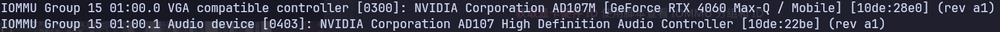

配置 Dracut 强制加载 VFIO 驱动

编辑文件

```
sudo vim /etc/dracut.conf.d/vfio.conf
```

写入以下内容

```
add_drivers+=" vfio vfio_pci vfio_iommu_type1 "
```

`add_drivers+=`：告诉 Dracut 在生成 initramfs 时，必须把这几个模块打包进去

绑定显卡 ID

我们需要告诉内核：“这两个 ID 的设备，归 vfio-pci 管，别让 nvidia 或 nouveau 碰它们”。

`vfio-pci.ids`的值替换为你的实际 ID

```
sudo grubby --update-kernel=ALL --args="vfio-pci.ids=10de:28e0,10de:22be rd.driver.pre=vfio_pci"
```

`rd.driver.pre=vfio_pci`：这是一个保险措施，确保在 initramfs 阶段 `vfio_pci` 比显卡驱动更早加载。

重新生成 Initramfs

```
sudo dracut -f -v
```

`-f`：强制覆盖当前的 initramfs 镜像
`-v`：显示过程，觉得输出内容太多可以不加

重启后，检查驱动绑定情况（使用你自己的显卡硬件ID）:

```
lspci -nnk -d 10de:28e0
```

成功的标志： 输出中应该包含：`Kernel driver in use: vfio-pci`，如果是 `nvidia` 或 `nouveau`，说明隔离失败（通常是 dracut 没配置好或者 ID 写错了）。

参考我的


其实发现副屏不亮我就知道隔离成功了


**如果想取消显卡直通**

移除内核参数

请把下面的 ID 换成你自己的

```
sudo grubby --update-kernel=ALL --remove-args="vfio-pci.ids=10de:28e0,10de:22be rd.driver.pre=vfio_pci"
```

然后删除vfio.conf文件

```
sudo rm /etc/dracut.conf.d/vfio.conf
```

重建 Initramfs

```
sudo dracut -f -v
```

重启即可


这个来回切换的过程可以写成脚本

编辑文件

```
sudo vim /usr/local/bin/switch-gpu-owner
```

写入如下内容，注意修改VFIO_IDS的值为你的显卡硬件ID

```
#!/bin/bash

# 你的显卡和音频设备 ID (必须修改这里)
VFIO_IDS="10de:28e0,10de:22be"

DRACUT_CONF="/etc/dracut.conf.d/vfio.conf"

R=$(tput sgr0)
B=$(tput bold)
GREEN=$(tput setaf 2)
PURPLE=$(tput setaf 5)
RED=$(tput setaf 1)
CYAN=$(tput setaf 6)
YELLOW=$(tput setaf 3)

I_LINUX="🐧"
I_WIN="🪟"

if [ "$EUID" -ne 0 ]; then
  echo "${RED}错误: 请使用 sudo 运行${R}"
  exit 1
fi

clear
printf "${B}:: 显卡直通模式切换器 ::${R}\n\n"

if grubby --info=DEFAULT | grep -q "vfio-pci.ids=$VFIO_IDS"; then
    MODE="TO_HOST"
    
    printf "当前状态: ${PURPLE}${I_WIN}  直通模式 (VM 独占)${R}\n"
    printf "准备切换: ${GREEN}${I_LINUX}  主机模式 (Linux 使用)${R}\n"

else
    MODE="TO_VM"
    
    printf "当前状态: ${GREEN}${I_LINUX}  主机模式 (Linux 使用)${R}\n"
    printf "准备切换: ${PURPLE}${I_WIN}  直通模式 (VM 独占)${R}\n"
fi

printf "\n${B}确认执行? [y/N]: ${R}"
read CONFIRM
[[ "$CONFIRM" =~ ^[Yy]$ ]] || exit 0

printf "\n--------------------------------\n"

if [ "$MODE" == "TO_HOST" ]; then
    printf "正在移除内核参数... "
    grubby --update-kernel=ALL --remove-args="vfio-pci.ids=$VFIO_IDS rd.driver.pre=vfio_pci"
    echo "✔"

    printf "正在删除强制隔离配置... "
    rm -f "$DRACUT_CONF"
    echo "✔"

else
    printf "正在添加内核参数... "
    grubby --update-kernel=ALL --args="vfio-pci.ids=$VFIO_IDS rd.driver.pre=vfio_pci"
    echo "✔"

    printf "正在创建强制隔离配置... "
    echo 'add_drivers+=" vfio vfio_pci vfio_iommu_type1 "' > "$DRACUT_CONF"
    echo "✔"
fi

printf "\n${YELLOW}正在重建 Initramfs (Dracut verbose)...${R}\n"
printf "屏幕将输出详细日志，请等待...\n\n"

dracut -f -v

if [ $? -eq 0 ]; then
    printf "\n${B}${GREEN}✅ 切换成功！${R}\n"
    read -p "立即重启? [y/N]: " RB
    [[ "$RB" =~ ^[Yy]$ ]] && reboot
else
    printf "\n${B}${RED}❌ 失败！请检查上方错误日志。${R}\n"
    exit 1
fi
```

添加执行权限

```
sudo chmod a+x /usr/local/bin/switch-gpu-owner 
```

然后就可以通过使用命令快捷切换显卡归属

```
sudo switch-gpu-owner
```

注意：系统内核升级后，可能需要重新运行此脚本以确保 Initramfs 包含正确的驱动配置。


#### 3.配置windows虚拟机

下载windows镜像后，打开应用**虚拟系统管理器**安装win11虚拟机

CPU配置可以参考`lscpu`命令的信息酌情配置

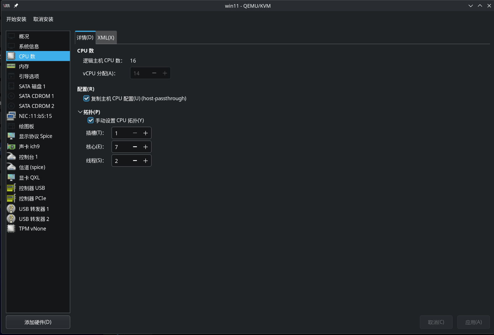


下载`virtio-win` 

**下载地址（官方最新稳定版 ISO）：** [https://fedorapeople.org/groups/virt/virtio-win/direct-downloads/stable-virtio/virtio-win.iso](https://www.google.com/search?q=https://fedorapeople.org/groups/virt/virtio-win/direct-downloads/stable-virtio/virtio-win.iso&authuser=1)

添加一个CDROM,镜像选择`virtio-win`，`virtio-win`是 Windows 虚拟机在 KVM 下专用的一套**半虚拟化驱动包**（类似于“主板驱动光盘”），必须挂载它才能让 Windows 识别高性能的 VirtIO 硬盘、网卡以及 Looking Glass 所需的内存共享设备。

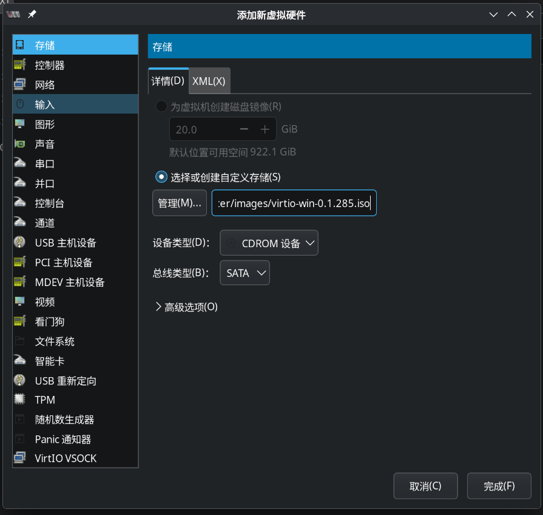

网络的设备型号选virtio,网络源选NAT和桥接我觉得在性能上没什么区别，选桥接的话理论上网络传输效率更高，而且如果有局域网串流画面的需求，更推荐使用桥接模式

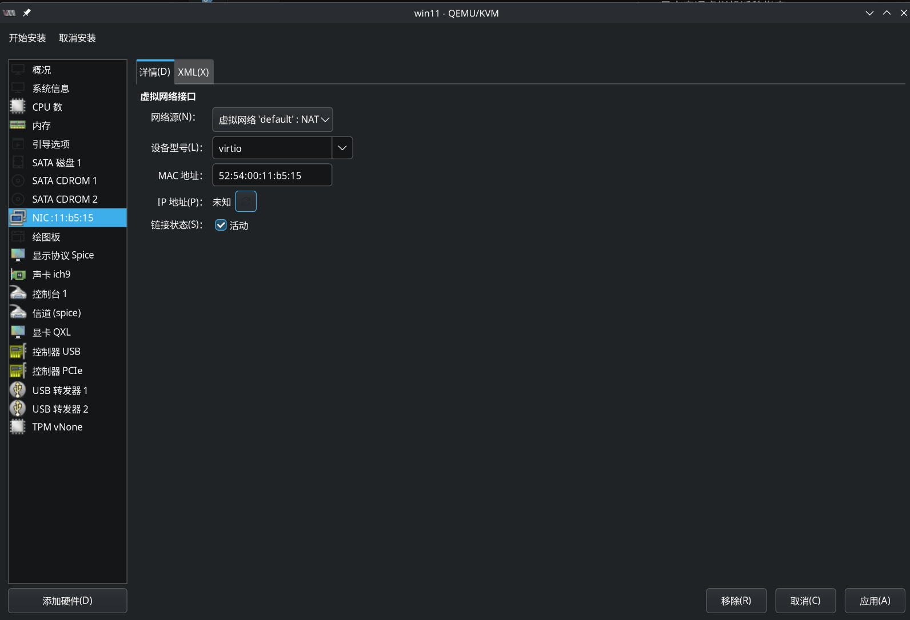


添加PCI主机设备，把显卡那一组的硬件设备添加进去（我的4060一组有两个）

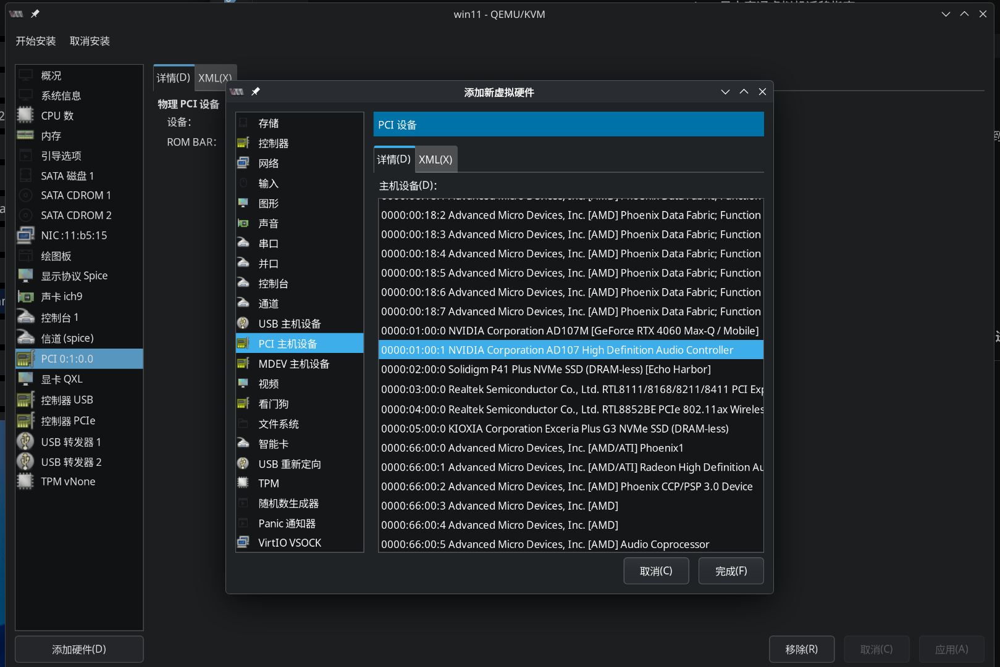

注意磁盘的总线应该选择virtio而不是SATA,因为SATA的虚拟化性能较差，刚刚创建虚拟机时选择存储时的总线忘记修改了，我们把SATA的删掉，重新添加一个virtio的，**另外绘图板要删除掉！**，做完了才发现不删除绘图板会导致鼠标输入异常

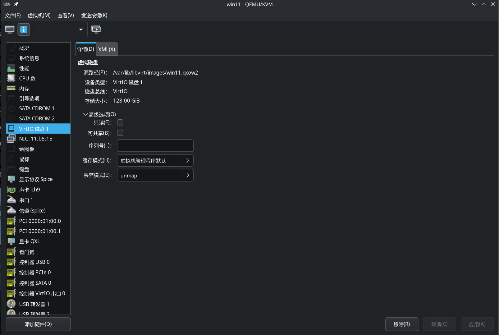

然后开始安装，开机后在界面出现`Press any key to boot from CD or DVD`时回车进入windows的安装界面，手慢了会进入下面这个界面

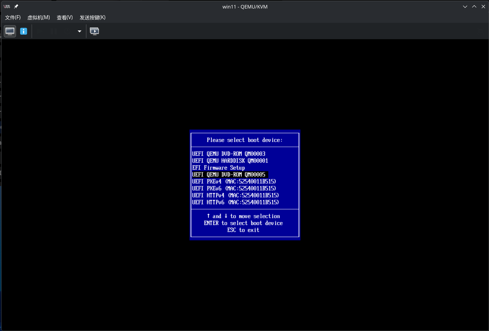

选择第一行回车，再次出现`Press any key to boot from CD or DVD`时回车即可

一路下一步，产品密钥没必要写

在这里点击`加载驱动程序`


找到驱动程序并选中安装，这里的E盘对应的是刚刚添加的`win-virtio`的`CDROM`，注意磁盘名即可

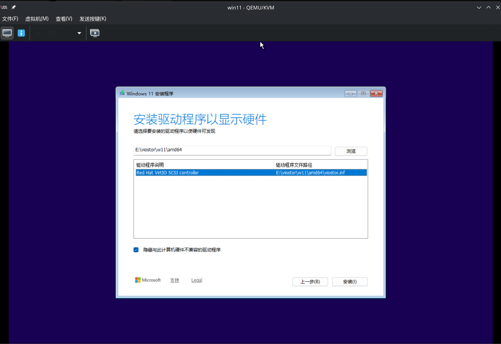

安装后，磁盘总线类型为virtio的磁盘才会被识别

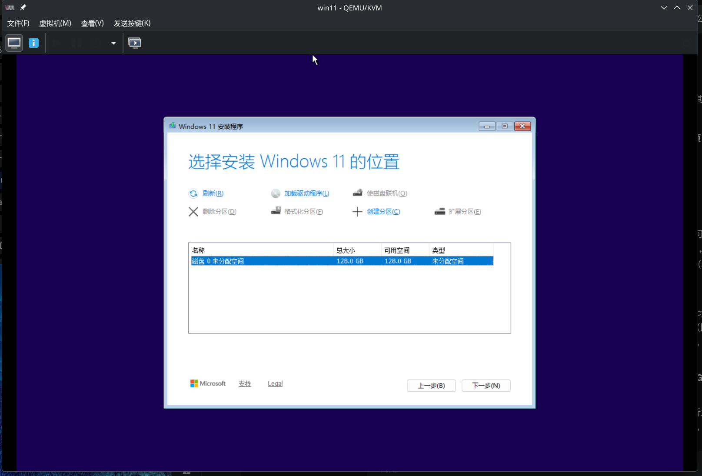


接着在这个界面按下`Shift` + `F10`打开cmd,输入指令`OOBE\BYPASSNRO`来跳过联网强制验证，因为这时virtio类型的网卡还没打驱动，虚拟机是断网的

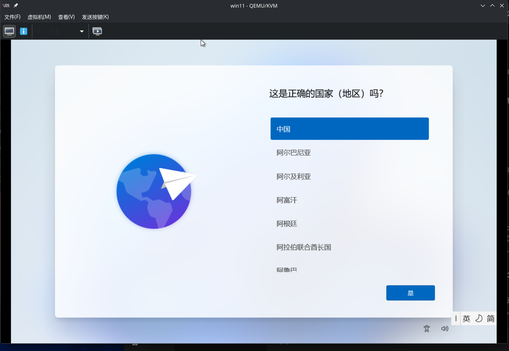

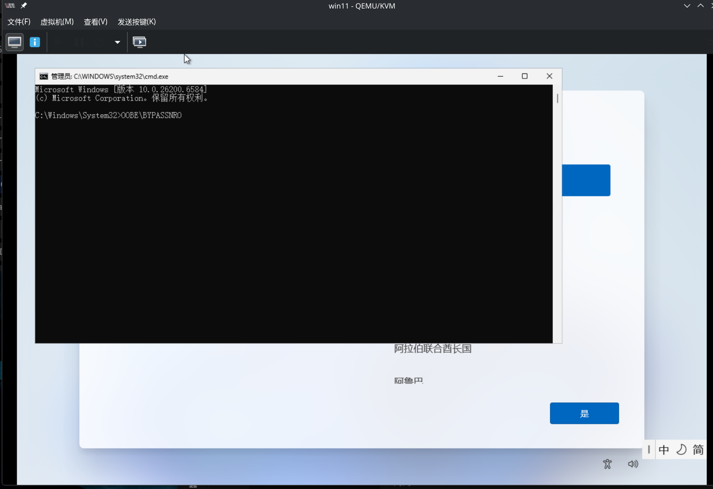

输入指令后会自动重启，然后跟着下一步，在这里选择`我没有Internet连接`

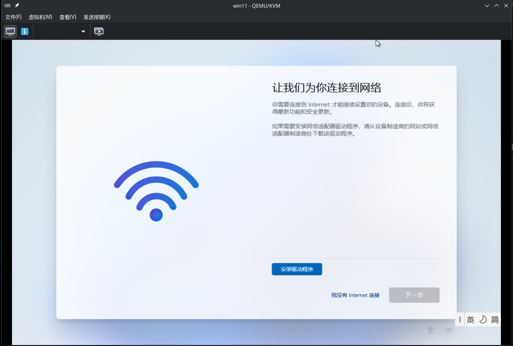

然后一直跟着流程走，进入桌面后，打开文件管理器在E盘（也就是win-virtio的那个盘），双击那个选中的`virtio-win-guest-tool`安装驱动程序

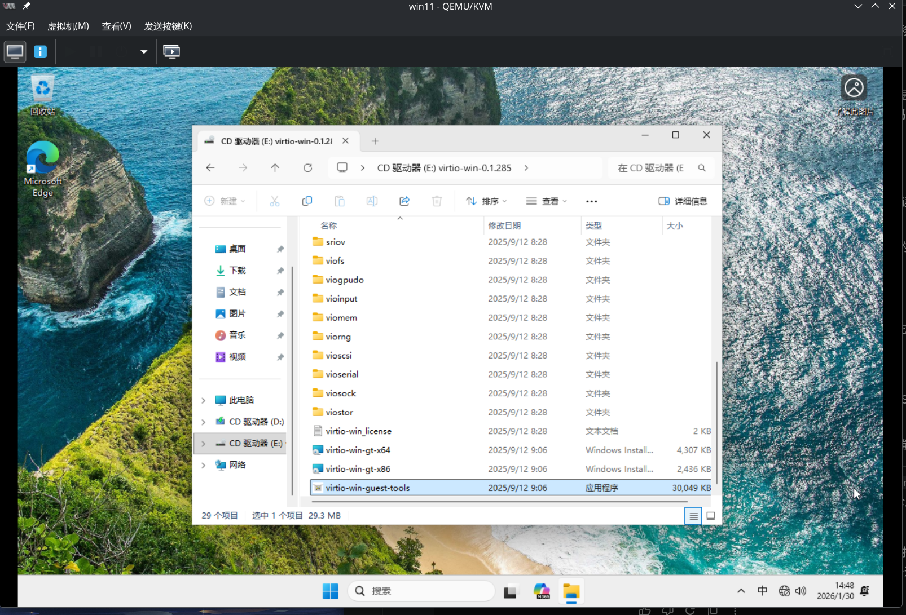

安装后可以看到虚拟机通网了，这时就可以上英伟达官网安装显卡驱动（因为刚刚添加了显卡硬件设备到虚拟机中）,到这里就算完成了显卡直通，


#### 4.配置looking glass

如果你像我一样是笔记本且副屏不常使用，那么你就需要接下来的`looking glass`方案,`lookingglass`配合虚拟显示器`virtual dispaly driver`实现了无头模式的虚拟机，也就是说，我可以在虚拟机管理器中启动虚拟机，然后通过looking glass 客户端连接那个虚拟的桌面，这样就不需要我连接副屏或是在虚拟机控制台上操作了，而且lookingglass是通过内存共享的画面，比控制台的画面和帧率要好很多

前置条件是在虚拟机中安装`Virtual-Display-Driver`和`looking glass`

Virtual-Display-Driver下载地址

https://www.google.com/search?q=https://github.com/itsmiketheb/Virtual-Display-Driver/releases&authuser=1

looking glass下载地址

https://looking-glass.io/downloads

`looking glass`网页拉到最下面下载`Bleeding Edge`的最新版（不是一定要下载最新版，注意linux端和windows虚拟机的looking glass的版本对应即可）

两个工具都根据系统提示安装

然后关闭虚拟机，打开`虚拟系统管理器`，在`编辑->首选项`中启用xml编辑

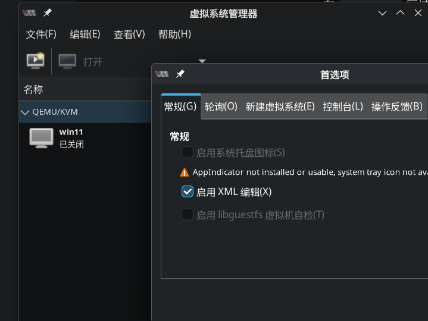

回到虚拟机概况，打开xml,写入高亮的那几行

注意：64 MB 对于 2K/4K 分辨率比较稳，如果你只用 1080p，32 也行。


然后在宿主机安装lookingglass,因为我们在windows客户端中安装的是最新的bleededge版本，所以fedora上我们需要编译安装最新的lookingglass,做好版本对应

安装编译依赖

```bash
sudo dnf install cmake gcc-c++ \
    wayland-devel wayland-protocols-devel \
    libxkbcommon-devel libglvnd-devel fontconfig-devel \
    spice-protocol nettle-devel binutils-devel \
    libX11-devel libXScrnSaver-devel libXrandr-devel \
    libXi-devel libXfixes-devel libXinerama-devel \
    libXcursor-devel libXpresent-devel \
    libdecor-devel dnf-plugins-core
```


克隆源码

必须加上 `--recursive` 参数，因为 Looking Glass 依赖很多子模块（如 PureSpice, imgui 等）

```
git clone --recursive https://github.com/gnif/LookingGlass.git
cd LookingGlass
```

编译与安装


进入客户端目录

```
cd client
```

创建并进入构建目录

```
mkdir build
cd build
```

生成 Makefile (自动检测依赖)

```
cmake ../
```

多核编译

```
make -j$(nproc)
```

安装到系统 (默认 /usr/local/bin)

```
sudo make install
```


创建共享内存配置文件

```
sudo vim /etc/tmpfiles.d/10-looking-glass.conf
```

写入如下内容(注意用户名的修改)

```
# 类型  路径                    权限  用户    组      -
f      /dev/shm/looking-glass  0660  caster  qemu    -
```

立刻让配置生效

```
sudo systemd-tmpfiles --create /etc/tmpfiles.d/10-looking-glass.conf
```

然后回到虚拟机的硬件管理，删除`显卡QXL`,另外`显示协议Spice`不要删除，图片里我删错了，必须要确保`显示协议Spice`存在才行，没有的话添加一个

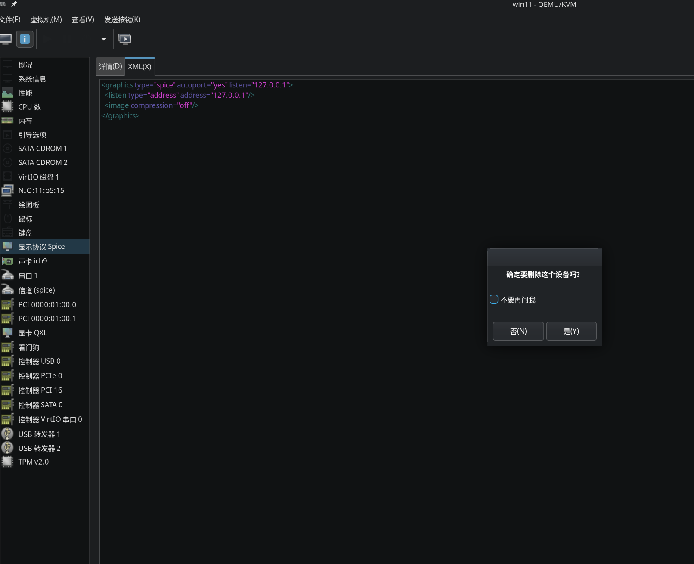

然后添加两个设备，virtio类型的键盘和鼠标，键盘直接在 `添加设备->输入` 里找，鼠标则需要修改原本的鼠标的xml文件，将选中的`ps2`修改为`virtio`并应用，就会出现virtio类型的鼠标了

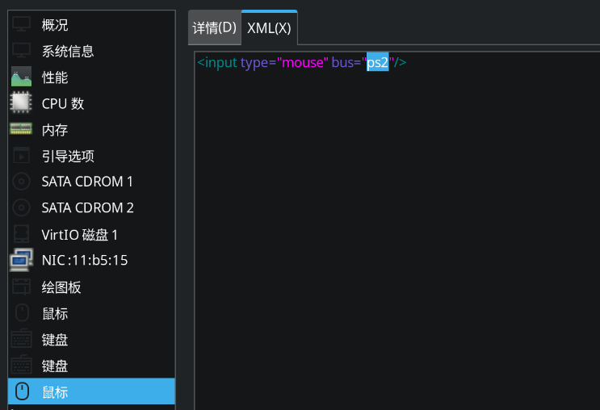

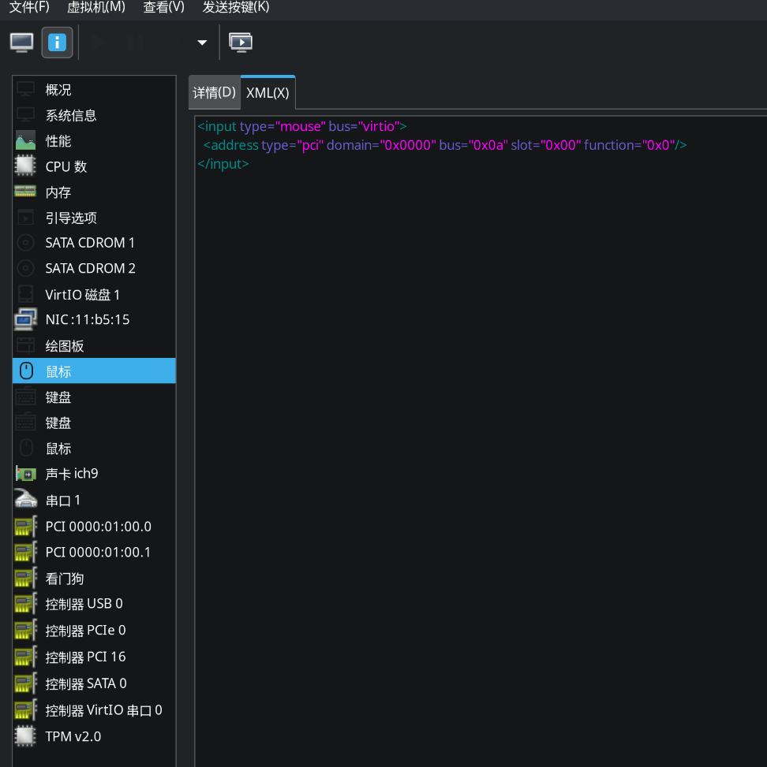

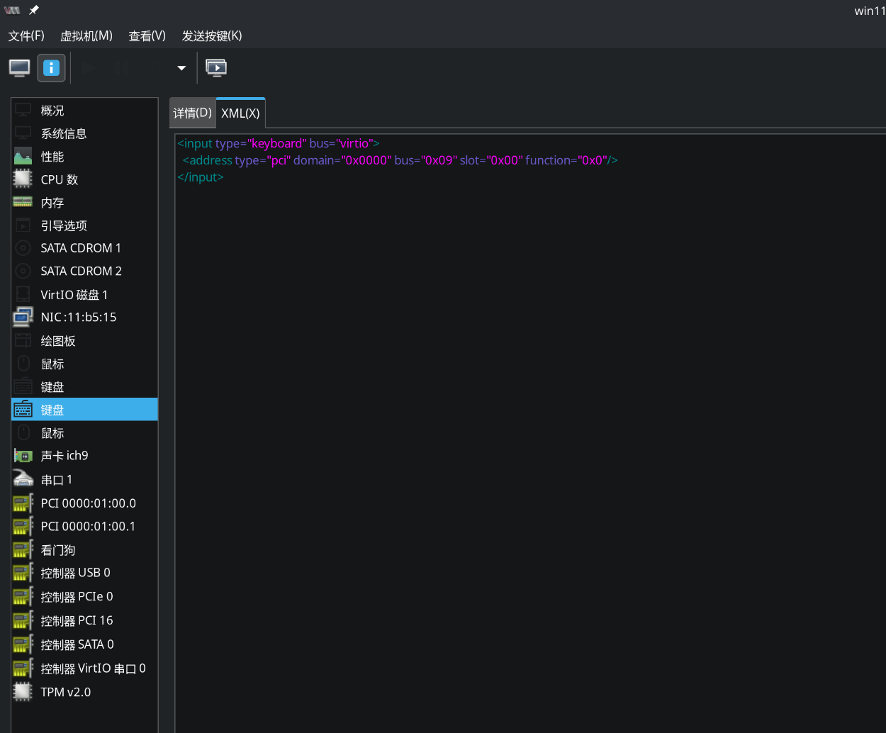

出于安全策略，selinux会拦截lookingglass,因此有两个选择，一个是生成规则来让selinux放行，另一个是直接禁用selinux,禁用selinux较为简单，但selinux也是fedora不得不品的特色之一，所以这里的方案是让selinux放行

我们需要 `audit2allow` 这个工具来生成策略，因此需要确保它的安装

```
sudo dnf install policycoreutils-python-utils
```

抓取拦截日志并生成策略

```
sudo grep "looking-glass" /var/log/audit/audit.log | audit2allow -M lookingglass_local
```

安装策略模块

```
sudo semodule -i lookingglass_local.pp
```

安装`looking glass`指定字体包，没有这个字体就打不开looking glass多少有点抽象了

```
sudo dnf install dejavu-sans-mono-fonts
```

然后正常打开虚拟机即可

虚拟机开机后打开应用`looking glass Client`或者在命令行输入`looking glass Client`启动即可


## 桌面美化

美化文件可以在kdelook上找

| **资源类型**                 | **解压后放到的路径 (都在 ~/.local/share/ 下)**    |
| ------------------------ | -------------------------------------- |
| **Plasma 样式** (任务栏/面板)   | `~/.local/share/plasma/desktoptheme/`  |
| **全局主题** (Look and Feel) | `~/.local/share/plasma/look-and-feel/` |
| **图标** (Icons)           | `~/.local/share/icons/`                |
| **鼠标指针** (Cursors)       | `~/.local/share/icons/` (是的，也是这里)      |
| **配色方案** (Color Schemes) | `~/.local/share/color-schemes/`        |
| **窗口边框** (Aurorae)       | `~/.local/share/aurorae/themes/`       |

### 状态栏美化

默认的任务栏不尽人意，可以安装plasma小部件`Panel colorizer`，这个组件里面有很多内置的任务栏主题可供选择

右键进入编辑模式，点击左上角添加或管理小部件--->获取新小部件--->下载新Plasma小部件，里面搜索`Panel colorizer`并安装，然后将该组件添加到任务栏上后配置即可

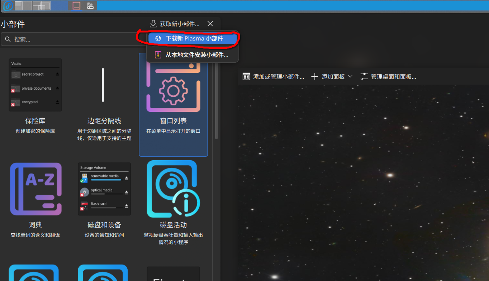


### 视频壁纸

在壁纸插件设置中安装插件smart video wallpaper reborn，该插件只支持播放视频类型壁纸，如果想同时使用静态和动态壁纸的话，可以将普通静态壁纸转换为mp4来伪装成视频，我这里选择使用脚本批量转换

在指定的壁纸存储目录下编辑脚本

```
vim run.sh
```

写入如下内容

```bash
#!/bin/bash

# 创建一个 output 文件夹，防止搞乱原文件
mkdir -p converted

echo "开始轻量级转换（低负载模式）..."

for f in *.jpg *.jpeg *.png; do
    [ -e "$f" ] || continue
    
    # 输出到 converted 文件夹
    output="converted/${f}.mp4"
    
    if [ ! -f "$output" ]; then
        echo "正在处理: $f"
        
        # -preset ultrafast: 极速模式，CPU 摸鱼专用，几乎不发热
        # -t 5: 只生成 5 秒视频 (反正插件会循环，5秒够了，硬盘写入更少)
        # -tune stillimage: 告诉编码器这是静止图，优化性能
        
        ffmpeg -hide_banner -loglevel error -y -loop 1 -i "$f" \
               -c:v libx264 -preset ultrafast -tune stillimage \
               -c:a aac -f mp4 -pix_fmt yuv420p \
               -vf "scale=ceil(iw/2)*2:ceil(ih/2)*2" \
               -t 5 "$output"
    fi
done

echo "完成！请去 converted 文件夹查看结果。"
```

执行脚本

```
bash run.sh
```

然后就可以通过插件使用这些静态壁纸转化后的伪动态壁纸了


鼠标指针
https://store.kde.org/p/1358330

图标主题
https://store.kde.org/p/1305251

应用程序风格
https://store.kde.org/p/2233462


## 玩游戏

开启 RPM Fusion 源

Fedora 官方源出于开源协议，不包含 Steam 和很多非自由驱动。你必须先开启 RPM Fusion

```
sudo dnf install https://mirrors.rpmfusion.org/free/fedora/rpmfusion-free-release-$(rpm -E %fedora).noarch.rpm https://mirrors.rpmfusion.org/nonfree/fedora/rpmfusion-nonfree-release-$(rpm -E %fedora).noarch.rpm
```

重新扫描一下系统核心组件，看看有没有需要升级或者修补的

```
sudo dnf group upgrade core
```

安装steam和lutris

```
sudo dnf install steam lutris gamemode
```

`gamemode`: 它是电脑的“自动运动模式”，能在你启动游戏时，自动把 CPU 和显卡锁定在高性能状态，防止卡顿。

steam刚开始打开会给人一种打开失败或是闪退的错觉，实际上是因为它的初始化窗口一般不会显示出来，可以尝试打开终端输入`steam`来启动steam观察有无异常报错，没有的话耐心等待即可

然后打开lutris完成初始化组件下载

接着给lutris配置GEproton和DWproton

安装flatpak的prontonplus

```
sudo flatpak install com.vysp3r.ProtonPlus
```

然后打开`protonplus`下载最新的`GEpronton`和`DWproton`,完成后打开`lutris`,替换`wine`的默认版本为`dwproton`（可选，我觉得dwproton好一点吧，就是个单纯的工具选择问题）

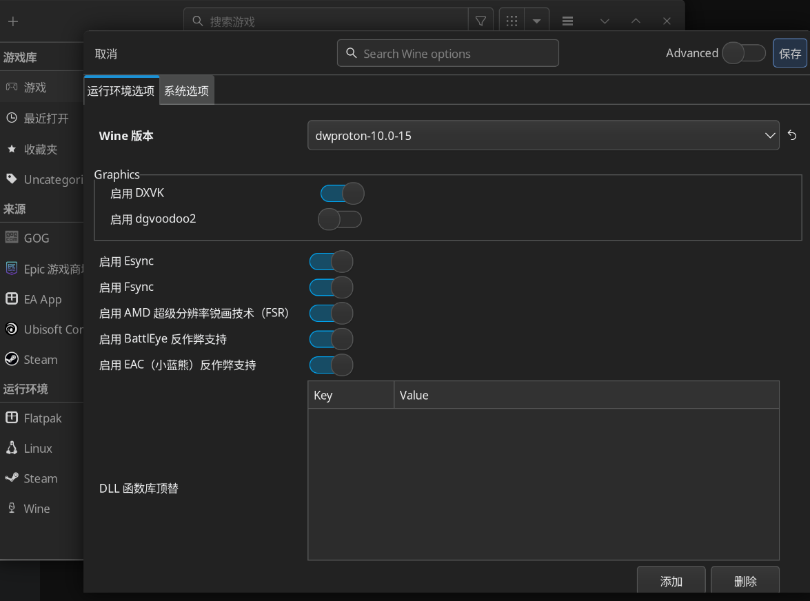

如果需要游戏性能监视器，可以装一个`mangohud`,它不仅有性能监视器的功能，不过一般都用来做这个

```
sudo dnf install mangohud
```

玩游戏要使用这个的话，lutris里面有对应开关

然后给steam配置GEproton使用，有个图形化工具可以实现一键安装

```
flatpak install flathub net.davidotek.pupgui2
```


## Fedora 视频播放黑屏/报错 (6003)

前面有提到这个问题，但还是保留这个报错供参考

这涉及到一个有意思的事情，H.264 (AVC) 和 H.265 (HEVC) 是**有专利保护**的专有编码格式（归 MPEG LA 所有），Fedora作为一家总部位于美国（Red Hat）且服务于企业级的发行版，为了避免任何潜在的法律诉讼风险，Fedora 官方仓库坚决不收录任何涉及专利费的解码器。所以Fedora 预装的 `ffmpeg` 和 `libavcodec` 是”阉割版“，官方包名通常带 `-free` 后缀（如 `libavcodec-free`, `libswscale-free`），它们只能解码 VP9, AV1, Ogg 等开源格式。一旦遇到 H.264/H.265，它们会直接“装死”或者返回不支持。

为什么会报“网络错误”而不是“解码错误”呢

浏览器行为：Firefox/Chrome 在 Linux 上通常调用系统的 ffmpeg 库来解码视频。

**故障链条**：

1. 网站播放器请求 H.264 视频流。
2. 浏览器把数据喂给系统的 `libavcodec`。
3. 阉割版库接不住数据，导致解码管线 (Pipeline) 崩溃或卡死。
4. 播放器的 JS 逻辑长时间收不到渲染好的画面帧。
5. 播放器判定为“数据拉取超时”或“连接中断”，于是抛出 **6003 (网络错误)** 或直接黑屏。


因此需要加上--allowerasing参数在安装新包的同时卸载旧的阉割版

```
sudo dnf install ffmpeg-libs libavcodec-freeworld mesa-va-drivers-freeworld --allowerasing
```


# Fedora Silverblue

我选择的版本是Fedora Silverblue 43，原装GNOME版本的

## 安装显卡驱动

安装 RPM Fusion 软件源

```
sudo rpm-ostree install https://mirrors.rpmfusion.org/.../rpmfusion-free-release... https://mirrors.rpmfusion.org/.../rpmfusion-nonfree-release...
```

然后重启

```
systemctl reboot
```

安装显卡驱动

```
sudo rpm-ostree install akmod-nvidia xorg-x11-drv-nvidia xorg-x11-drv-nvidia-cuda
```

修改 GRUB 启动参数，屏蔽开源驱动，启用 NVIDIA 高级特性。

```
sudo rpm-ostree kargs --append=rd.driver.blacklist=nouveau --append=modprobe.blacklist=nouveau --append=nvidia-drm.modeset=1
```

重启后验证驱动

```
systemctl reboot
```

```
nvidia-smi
```


## 不想用GNOME

uBlue 的服务器/核心版，**没有桌面环境**，但集成了 NVIDIA 驱动。

```
sudo rpm-ostree rebase ostree-unverified-registry:ghcr.io/ublue-os/ucore:stable-nvidia
```

`ublue-os/ucore:stable-nvidia` 这个镜像是 uBlue 社区**帮你预先把驱动编译好并打包进系统里了**

如果刚刚不小心在GNOME下安装了显卡驱动则需要改用这条命令

```
sudo rpm-ostree rebase ostree-unverified-registry:ghcr.io/ublue-os/ucore:stable-nvidia \
  --uninstall=akmod-nvidia \
  --uninstall=xorg-x11-drv-nvidia \
  --uninstall=xorg-x11-drv-nvidia-cuda \
  --uninstall=rpmfusion-free-release \
  --uninstall=rpmfusion-nonfree-release
```

## 安装基础软件包

安装hyprland合成器和必须的终端还有一些基础软件包

配置hyprland源

```
sudo curl -Lo /etc/yum.repos.d/solopasha-hyprland.repo https://copr.fedorainfracloud.org/coprs/solopasha/hyprland/repo/fedora-rawhide/solopasha-hyprland-fedora-rawhide.repo
```

```
sudo rpm-ostree install hyprland kitty wofi xdg-desktop-portal-hyprland lxpolkit google-noto-sans-cjk-sc-fonts jetbrains-mono-fonts
```


`wofi`：**应用启动器**。类似 dmenu 或 rofi。在 Wayland 下，我们需要它来作为菜单启动其他程序。
`xdg-desktop-portal-hyprland`：**门户后端**。这个极其重要。它是应用程序（如 OBS、浏览器）和 Wayland 之间的沟通桥梁。没有它，你无法进行屏幕共享，Flatpak 应用也打不开文件选择框。
`lxpolkit`：**权限认证代理**。uCore 是服务器系统，不带 GUI 认证代理。如果不装这个，当你打开需要 root 权限的 GUI 软件（如 GParted）时，因为弹不出密码输入框，程序会直接卡死或闪退。
`google-noto-sans-cjk-sc-fonts`：**中文字体**。uCore 默认没有任何中文字体，不装这个，你看到的中文全是方块（□□□）。
`jetbrains-mono-fonts`：**等宽字体**。终端和代码编辑器需要。不装的话，Kitty 终端可能会无法显示或者乱码。


没啥意思暂时不玩这个了


# CachyOS(Hyprland)

## 安装时的镜像源问题

这里选择配置国内的中科大源

**Arch 基础源** 

编辑文件

```
vim /etc/pacman.d/mirrorlist
```

在Server开头的第一行写入

```
Server = https://mirrors.ustc.edu.cn/archlinux/$repo/os/$arch
```

**CachyOS 通用源** 

```
vim /etc/pacman.d/cachyos-mirrorlist
```

在Server开头的第一行写入

```
Server = https://mirrors.ustc.edu.cn/cachyos/repo/$arch/$repo
```

**CachyOS V3 优化源** 

```
vim /etc/pacman.d/cachyos-v3-mirrorlist
```

在Server开头的第一行写入

```
Server = https://mirrors.ustc.edu.cn/cachyos/repo/$arch_v3/$repo
```

**CachyOS V4 优化源**

```
vim /etc/pacman.d/cachyos-v4-mirrorlist
```

在Server开头的第一行写入

```
Server = https://mirrors.ustc.edu.cn/cachyos/repo/$arch_v4/$repo
```

然后注释`/etc/calamares/scripts/update-mirrorlist`这个脚本里面的内容再开始安装即可


## tun模式无效

因为cachyos使用了ufw，需要放行相关规则，嫌麻烦可以直接禁用ufw

这里选择放行规则

使用ip a查看网卡名称，Mihomo是我的虚拟网卡名，enp3s0是我的有线网卡名，wlan0是我的无线网卡名

```
sudo ufw allow in on Mihomo
sudo ufw allow out on Mihomo
sudo ufw route allow in on Mihomo out on wlan0
sudo ufw route allow in on Mihomo out on enp3s0
sudo ufw reload
```


## 工具配置

安装nautilus全套工具，包含nautilus，预览工具，解压工具等，重要的是polkit-gnome，这是密码认证工具，有些应用需要输入密码才能打开，这个工具会显示密码认证弹窗

```
sudo pacman -S nautilus sushi file-roller unrar p7zip gvfs-mtp gvfs-smb gnome-disk-utility polkit-gnome
```


# git的使用

## obsidian自动化推送笔记到github备份

是想实现我的markdown笔记云端备份，因此选择了github私有仓库  
本地仓库目录/home/caster/Documents/Study_Note  

进入目录  

```
cd /home/caster/Documents/Study_Note  
```

**1.生成该仓库专用的独立密钥**  

```
ssh-keygen -t ed25519 -f ~/.ssh/id_ed25519_obsidian -C "linux_note_key"  
```

一路回车即可  

在github上创建私有仓库linuxnote  
  

**2.将密钥配置到 GitHub 仓库**  
查看并复制公钥  

```
cat ~/.ssh/id_ed25519_obsidian.pub  
```

去网页端设置  
打开GitHub 仓库 `linuxnote` 页面  
点击 **Settings**（选项卡） -> 左侧找到 **Deploy keys**  
点击 **Add deploy key**  
**Title**: 随便填,我写的archlinux  
**Key**: 粘贴刚才 `cat` 出来的全部内容  
**重要**：勾选 **Allow write access**（允许写入权限）  
点击 **Add key** 保存。  

**3.配置 SSH Config (让 Git 认识新密钥)**  
编辑配置文件  

```
vim ~/.ssh/config  
```

写入如下内容  

```

Host github-notes
    HostName github.com
    User git
    IdentityFile ~/.ssh/id_ed25519_obsidian

```

**4.初始化并提交笔记**  
初始化与设置身份  

```
git init  
git config user.email "github绑定邮箱@gmail.com"  
git config user.name "github用户名"  
```

添加文件并提交  

```
echo ".obsidian/" >> .gitignore  
git add .  
git commit -m "Initial commit: my linux notes with independent key"  
```

**关联远程仓库（使用别名）**： 注意！这里的地址用刚才在 config 里起的别名 `github-notes`  
```
git branch -M main  
git remote add origin git@github-notes:Caster6443/linuxnote.git  
```

推送  

```
git push -u origin main  
```

obsidian的第三方插件下载插件Git，作者vinzent，启用后设置推送间隔，其余的该插件都会自动检测  

至此完成了obsidian自动化推送markdown笔记到github的私有仓库的配置  

## Git仓库推送流程

在github上弄了dotfiles仓库用于个人配置文件存储，项目地址https://github.com/Caster6443/dotfiles，前置认证流程就不记录了，这里记录一下使用方法  

我把本地仓库放在/home/caster/Documents/my-dotfiles处  
进入本地目录后  

```
git status  
```

检查本地与上游git仓库的文件变化，查看本地相较于git仓库多了哪些变化  
确定无误后  

```
git add .  
```

暂存所有修改，准备提交  

```
git commit -m "这里写点描述"  
```

将暂存区的更改打包成一个历史记录点，并附上一条描述。  

```
git push origin main  
```

推送更改  

我设置了 SSH 密钥并启动了ssh-agent，Git 会自动使用我的私钥进行身份验证，不需要重复输入用户名或密码。  

## git 如何指定添加编译某个 pr

其实是为了解决微信在 niri 环境下无法右键的问题，在 xwayland-satellite 项目下面发现了有人提交的 pr 可以解决该问题，因此需要指定该 pr 提交的代码编译进去  

流程如下  

1.安装编译依赖  

```
sudo pacman -S --needed rust cargo git  
```

2.克隆仓库  

```
git clone https://github.com/Supreeeme/xwayland-satellite.git  
cd xwayland-satellite  
```

fix: popup position #281 这是 pr 的标题，后面是 pr 的编号 281  

3.拉取并切换到 PR #281  
从 GitHub 拉取 281 号 PR 的代码，并存到一个叫 pr-281 的新分支里

```
git fetch origin pull/281/head:pr-281  
```

切换到这个分支  

```
git checkout pr-281  
```

4.编译  

```
cargo build --release  
```


5.替换并生效  
备份旧的  

```
sudo mv /usr/bin/xwayland-satellite /usr/bin/xwayland-satellite.bak  
```

替换新的（注意路径是 target/release/）  

```
sudo cp target/release/xwayland-satellite /usr/bin/  
```

重启 Niri 生效  

```
niri msg action quit  
```

(或者直接重启电脑)  


# 常见问题

## 玩游戏帧率异常

玩鸣潮的时候发现帧率不对劲，帧率不稳定，一战斗就掉帧  
看一下 nvidia-smi 回显  
可以看到 N 卡处于 P8 状态（低功耗状态）,这时游戏挂在后台，p8 倒也没啥，不过正常玩的时候这玩意好像是一直处于 p8 状态，我也不确定  

运行这个命令,启用持久模式  

```
sudo nvidia-smi -pm 1  
```

解决了，这个我不确定是不是临时命令，但重启后也不用再次执行也能正常帧率玩鸣潮了，所以可能是 nvidia 的一点小 bug，这个命令刷新了 N 卡的状态 ,这种系统抽风问题最难搞了，感觉我不用这个命令，N 卡都不知道自己还有个持久模式😅  

## 软件包降级

clash-verge-rev 更新后发现 tun 模式打不开了，尝试了降级软件包处理  

1.首先 pacman 会在本地留下软件包缓存，首先检查这个目录下有没有需要的版本  

```bash
❯ ls /var/cache/pacman/pkg/ | grep clash
clash-geoip-202510300021-1-any.pkg.tar.zst
clash-geoip-202510300021-1-any.pkg.tar.zst.sig
clash-geoip-202511060021-1-any.pkg.tar.zst
clash-geoip-202511060021-1-any.pkg.tar.zst.sig
clash-verge-rev-2.4.3-1-x86_64.pkg.tar.zst
clash-verge-rev-2.4.3-1-x86_64.pkg.tar.zst.sig

#发现只有clash-geoip这个包有旧版本，于是尝试先把这个降级
❯ sudo pacman -U /var/cache/pacman/pkg/clash-geoip-202510300021-1-any.pkg.tar.zst

#发现没啥用，还是打不开tun模式，而本地又没有clash-verge-rev这个包的旧缓存，所以只能去aur仓库找

```

2.克隆 AUR 仓库并检测出旧版本  

```bash
git clone https://aur.archlinux.org/clash-verge-rev.git
cd clash-verge-rev

```

```bash
❯ git log --oneline --graph --decorate
● 7f0a825 (HEAD -> master, origin/master, origin/HEAD) [lilac] updated to 2.4.3-1
● 8168c5c [lilac] updated to 2.4.2-2
● 8bd360b Update sha512sums
● 4adeec4 [lilac] updated to 2.4.2-1
● 417ee86 [lilac] updated to 2.4.1-1
● 36a1a2e [lilac] updated to 2.4.0-1
● 93bfde8 [lilac] updated to 2.3.2-1
● a0a5484 [lilac] updated to 2.3.1-1
● b6503cb [lilac] updated to 2.3.0-2
● 9c4bd9a [lilac] updated to 2.3.0-1
● 3c510dd [lilac] updated to 2.2.3-3
● 3a2253d [lilac] updated to 2.2.3-2
● 0a10265 [lilac] updated to 2.2.3-1
● 29c9da4 [lilac] updated to 2.2.2-3
● 1fa194f [lilac] updated to 2.2.2-2
● 8f1ee0e [lilac] updated to 2.2.2-1
● fcec89c [lilac] updated to 2.2.1-2
● d01e243 [lilac] updated to 2.2.0-1
● 0b19316 Update from archlinuxcn
● 5719888 Update AUR package
● fb5473c Update AUR package
● 37a5344 Update AUR package
● f74a444 update
● 3443147 Update AUR package
● 11538b8 Update AUR package
● af53270 init
● 2d856f3 init

#开头的字符串是提交哈希

```

3.切换到旧版本提交  

切换到 2.3.0-2 版本 指定的是对应版本的提交哈希  

```
git checkout b6503cb 
```

4.构建和安装提交的版本

```
makepkg -si  
```

构建过程中出现了源文件校验和失败的问题，clash-verge-service.tar.gz 的 SHA512 校验和不匹配，这通常是因为源文件在服务器上已被更新，但 PKGBUILD 中的校验和还是旧值 

```
sudo pacman -S pacman-contrib  
```

在项目目录中运行  

```
updpkgsums  
```

这个命令会自动计算当前下载的源文件的 SHA512 校验和，并更新 PKGBUILD 中的 sha512sums 数组  

然后重新构建并安装 

```
makepkg -si  
```


然而 pacman -Syu 未来还是必要的，所以在这个问题修复前，我就让 clash-verge-rev 不要跟着一起更新吧  

```
sudo pacman -D --asexplicit clash-verge-rev clash-geoip  
```

这个命令的作用是将包标记为显式安装，而不是依赖安装  

通过手动构建安装的包，有时会被 pacman 错误标记为依赖包，如果卸载某些软件，该软件包被视为依赖，就会被 pacman 自动清理，标记为显示安装后，pacman 不会自动清理它  

```plain
❯ sudo echo 'IgnorePkg = clash-verge-rev clash-geoip' | sudo tee /etc/pacman.d/ignore.conf

IgnorePkg = clash-verge-rev clash-geoip

```

## ncmpcpp轻量化音乐播放系统

MPD + ncmpcpp + Cava  

1.安装必要软件  
需要安装四个组件：后台服务(MPD)、终端客户端(ncmpcpp)、媒体键支持(mpDris2)、可视化频谱(Cava)。  

```bash

# 1. 安装官方仓库软件
sudo pacman -S mpd ncmpcpp cava

# 2. 安装 AUR 插件 (用于支持 playerctl 和 Waybar 控制)
yay -S mpdris2

```

2.环境初始化  
MPD 默认会尝试以系统服务运行，读取 `/etc/mpd.conf`，这会导致权限错误 (`Failed to open /var/lib/...`)。必须手动创建用户目录并禁用系统服务。  

```bash

# 1. 停止并禁用系统级服务 (防止冲突)
sudo systemctl stop mpd sudo systemctl disable mpd
 # 2. 创建 MPD 必须的文件夹结构 (不做这一步 MPD 会启动失败)
mkdir -p ~/.config/mpd/playlists 

# 3. 创建空的状态文件 (防止 MPD 报找不到文件的错） 
touch ~/.config/mpd/{database,state,pid,sticker.sql} 

# 4. 创建 mpDris2 和 Cava 的配置目录 
mkdir -p ~/.config/mpdris2 mkdir -p ~/.config/cava

```

3.配置文件编写  
配置 MPD核心 (`~/.config/mpd/mpd.conf`)  

```bash

# 音乐目录 (根据实际情况修改)
music_directory    "~/Music"

# 必须的运行文件定义
playlist_directory "~/.config/mpd/playlists"
db_file            "~/.config/mpd/database"
log_file           "syslog"
pid_file           "~/.config/mpd/pid"
state_file         "~/.config/mpd/state"
sticker_file       "~/.config/mpd/sticker.sql"

# 网络设置 (仅限本机访问)
bind_to_address    "127.0.0.1"
port               "6600"

# 自动扫描新歌 & 恢复播放状态
auto_update        "yes"
restore_paused     "yes"

# 音频输出 1: 让你听到声音 (PipeWire/PulseAudio)
audio_output {
        type            "pulse"
        name            "PulseAudio"
}

# 音频输出 2: 可视化数据流 (给 Cava 用)

# 如果不加这个，Cava 只能读取麦克风或系统总声，不灵敏
audio_output {
    type                    "fifo"
    name                    "my_fifo"
    path                    "/tmp/mpd.fifo"
    format                  "44100:16:2"
}

```

配置 mpDris2 (`~/.config/mpdris2/mpdris2.conf`)  
让键盘多媒体键和 Waybar 能控制 MPD。  

```bash
[Connection]
host = 127.0.0.1
port = 6600
music_dir = ~/Music  # 必须和 MPD 音乐目录一致，用于读取封面

[Bling]
notify = false       # 切歌弹窗 (不喜欢可关)
mmkeys = true        # 启用键盘多媒体键支持

```

还要配置 cava 可视化，但我之前美化 waybar 的时候已经配过了  


4.启动服务  

```bash

# 重载配置
systemctl --user daemon-reload

# 启动并开机自启 MPD
systemctl --user enable --now mpd

# 启动并开机自启 mpDris2,不建议设置这个，因为会影响我的waybar的音频可视化

# 模块无法正常隐藏

# systemctl --user enable --now mpDris2

```

5.客户端 (ncmpcpp) 使用  
终端输入 ncmpcpp 进入界面。按 F1 可查看帮助。  
解决乱序播放/文件夹播放问题：  
1.按 1 进入播放列表。  
2.看右上角是否有 [z] 或高亮的 Random。如果有，按 z 键关闭随机模式。  
3.按 c 清空当前列表。  
4.按 2 进入文件浏览器，选中文件夹，按 空格 即可按顺序添加整张专辑。  

常用按键功能列表：  
1：播放列表（正在播放的歌单） 2：文件浏览（去硬盘找歌） 3：搜索（搜歌名/歌手） 空格：添加歌曲（将选中项加入列表） Enter：播放（立即播放选中项） p：暂停/继续（Pause）  
 ：下一首（. 键） <：上一首（, 键） c：清空列表（Clear） u：更新数据库（下载新歌后必按） z：随机模式开关（必须关闭才能顺序播放）  


后续优化  
为了和我的 waybar 组件配合，让 waybar 的音频可视化能够识别到 MPD 播放的音频，需要打开mpDris2 服务，但如果设置开启自启动的话，waybar 模块就会被一直占用不隐藏了，杀进程又太麻烦，所以写了一个 desktop 文件，用 fuzzel 打开后会在终端运行mpDris2 和 mpd 并打开 ncmpcpp，终端关闭后mpDris2 和 mpd 进程会被杀死，不赖  

```bash
❯ cat ~/.local/share/applications/ncmpcpp-temp-mpdris.desktop            
[Desktop Entry]
Type=Application
Name=Ncmpcpp(本地音乐播放器)
GenericName=Music Player
Comment=启动 mpd + mpDris2 + ncmpcpp，窗口关闭时全部销毁

# 核心逻辑解析：

# 1. mpd --no-daemon & -> 启动 MPD 但不让它后台化，这样我们才能获取它的 PID

# 2. mpDris2 &         -> 启动翻译器

# 3. trap "kill..."    -> 退出时同时杀掉 MPD 和 mpDris2 的 PID

# 4. ncmpcpp           -> 启动界面
Exec=kitty --class music_player --title "Music Player" -e bash -c 'mpd --no-daemon >/dev/null 2>&1 & MPD_PID=$!; sleep 0.5; mpDris2 >/dev/null 2>&1 & DRIS_PID=$!; trap "kill $MPD_PID $DRIS_PID 2>/dev/null" EXIT HUP TERM INT; ncmpcpp'
Icon=utilities-terminal
Terminal=false
Categories=Audio;Player;ConsoleOnly;

```

## arch 配置 FTP 服务

给我的 kvm_win7 传文件用  

安装软件  

```
sudo pacman -S python-pyftpdlib  
```

然后在需要共享的文件目录下运行  

```
python -m pyftpdlib
```

具体端口号和进程等信息会自动显示  

## grub设置链式引导

有些系统并不希望使用grub引导，比如pop!os有自己的system76引导，所以这时就需要链式引导来让这些系统使用自己的引导程序  
参考如下内容  

```

❯ cat /etc/grub.d/40_custom

#!/bin/sh
exec tail -n +3 $0

# This file provides an easy way to add custom menu entries.  Simply type the

# menu entries you want to add after this comment.  Be careful not to change

# the 'exec tail' line above.

menuentry 'Pop!_OS(Chainload)' {
    insmod part_gpt
    insmod fat
    insmod chain
    # 搜索 EFI 分区
    search --no-floppy --fs-uuid --set=root 9D1D-A9D4
    # 移交控制权给另一个系统的Shim 引导程序
    chainloader /EFI/BOOT/BOOTX64.EFI
}

```

释义  
声明菜单名 (`menuentry`)，这就是grub菜单里显示的名字  
`insmod` = Insert Module (插入模块)。  
`part_gpt`: 告诉 GRUB 怎么读 GPT 分区表  
`fat`: 告诉 GRUB 怎么读 FAT32 文件系统  

定位分区  
`search --no-floppy --fs-uuid --set=root 9D1D-A9D4`  
这句话像是在对 GRUB 喊话：“**全盘搜索！**”  
`--no-floppy`: 别搜软驱（节省时间）  
`--fs-uuid`: 我是用 UUID 来找的，不是用分区号（因为分区号 `/dev/sda1` 可能会变，UUID 永远不变）  
`--set=root`: 找到后，把这个分区设为当前的根目录 (root)  
9D1D-A9D4 EFI分区的UUID  

指定引导文件  
`chainloader /EFI/BOOT/BOOTX64.EFI`  
`chainloader`: 意思是我不直接引导内核了，我把控制权“移交”给另一个 `.efi` 文件。  
`/EFI/BOOT/BOOTX64.EFI`  
是 UEFI 的“默认回退路径”，如果一块硬盘或者 U 盘插上去，主板不知道该读哪个文件夹，主板就会**默认**去读这个文件。它是所有无主系统的“收容所”，但实在找不到系统对应的引导时，就可以使用这个路径，不过多数系统是有具体路径的，比如fedora的是/EFI/fedora/shimx64.efi  


## 混合显卡黑屏问题

具体表现在开机时，有几率在启动加载全部完成后会黑屏卡住，原因是显示管理器有概率会提前在显卡驱动加载前启动  

这个有两种解决方案  
一个是在mkinit 中配置 A 卡优先加载  
  
就是在 MODULES 里指定加载顺序即可，当然还需要sudo mkinitcpio -P重新加载一下配置  

另一个方案是把登录管理器的自启动服务添加一个 sleep 2延迟2秒启动  

## arch 打开文件夹却显示终端

就是发现在某些应用，我选择打开文件夹，打开的却是我的 kitty 终端，解决方案参考如下  

```

❯ xdg-mime query default inode/directory
kitty-open.desktop
❯ xdg-mime default org.gnome.Nautilus.desktop inode/directory
❯ xdg-mime query default inode/directory                     
org.gnome.Nautilus.desktop

```

## wps 无法切换中文

准确地说是让wps支持使用我的 fcitx5 输入法  
网上有个方案是在~/.pam_environment 中写入  

```

export GTK_IM_MODULE=fcitx
export QT_IM_MODULE=fcitx5
export XMODIFIERS=@im=fcitx

```

但貌似 wps 随着版本更新不再读取这个文件  


所以需要在/usr/bin/wps 中的gOpt=下面一行添加如下内容即可  

```

export GTK_IM_MODULE=fcitx
export QT_IM_MODULE=fcitx5
export XMODIFIERS=@im=fcitx

```

## wine 字体缺失

具体表现是某些字符会显示为“口”字的状态，通常是字体缺失导致的  
使用 Winetricks 自动安装字体  
winetricks是一个辅助脚本，专门用来给 Wine 安装各种依赖库和字体。  

安装 Winetricks  

```
sudo pacman -S winetricks
```

使用 Winetricks 安装 CJK 字体包：  
winetricks有一个专门的包叫 cjkfonts，它会自动下载并安装 Windows 上最常用的中日韩字体（包括 msgothic,msmincho等）到你的 Wine 环境中。  
继续在终端运行：  

```
winetricks cjkfonts
```

后续调优（可选）  
安装 Arch Linux 系统的 CJK 字体  
这个方案是在_Linux 系统层面_安装一套完整的高质量 CJK 字体。Wine (通过 Fontconfig) 理论上也能检测到并使用它们。  
安装 Noto CJK 字体包： `noto-fonts-cjk` 是 Google 和 Adobe 合作的开源字体，质量非常高，涵盖了中日韩所有字符。  
在终端运行：  

```
sudo pacman -S noto-fonts-cjk
```

刷新字体缓存（通常 pacman 会自动做，但手动做一次没坏处）：  

```
fc-cache -fv
```

```
sudo pacman -S adobe-source-han-serif-cn-fonts wqy-zenhei          #安装几个开源中文字体 一般装上文泉驿就能解决大多wine应用中文方块的问题
sudo pacman -S noto-fonts-cjk noto-fonts-emoji noto-fonts-extra    #安装谷歌开源字体及表情
```

我感觉没球用，不如群友打包的字体包，直接塞上就用  

## 蓝牙耳机有电流声

**随着系统滚动更新，该修复失效了，麻了**  
**环境：** Arch Linux + Niri (Wayland) + PipeWire + 蓝牙耳机 (漫步者 W820NB, 编码器:SBC)。  
**现象：** 播放音频时，偶尔会出现剧烈的“电击式”爆音或断流。  
**根本原因：** 音频缓冲区耗尽  

解决方案：  

```
pw-metadata -n settings 0 clock.force-quantum 2048  
```

临时扩充缓冲区  

为了永久生效，我配置了systemd服务  

```
systemctl --user edit --force --full force-quantum.service  
```

写入如下内容  

```

[Unit]
Description=Force PipeWire Quantum to 2048 for Bluetooth stability
After=pipewire.service wireplumber.service

[Service]
Type=oneshot

# 等待几秒确保 PipeWire 完全启动后再执行，防止命令跑太快失效
ExecStartPre=/usr/bin/sleep 5
ExecStart=/usr/bin/pw-metadata -n settings 0 clock.force-quantum 2048
RemainAfterExit=yes

[Install]
WantedBy=default.target

```

立刻启用  

```
systemctl --user enable --now force-quantum.service  
```

如何验证？  
`pw-top`命令查看  
  
bluez_output那一行是我的蓝牙耳机输出，从256变成了2048  

这个方案是用声音延迟的代价换取稳定  
原理我也不太懂，不过差不多可以这样理解  
`时间窗口=QUANT/48000Hz=xx.ms`  
我原本的QUANT是256，带入公式得到时间窗口大概是5.33ms(毫秒)  
意思是CPU必须每隔5.33毫秒就处理完一次音频数据，但是如果 Niri 渲染一帧画面抢占了 CPU 6 毫秒，音频线程就会错过截止时间。从而导致电流声等问题  
**新的时间窗口：** 2048/48000Hz≈42.66ms  
**容错率提升:** 从 5ms 提升到 42ms（约 8 倍）。即使 Niri 发生丢帧或高负载卡顿，音频缓冲区里仍有足够的数据存货，不会断流。  
**代价:** 系统音频延迟增加约 37ms。对于视频（播放器会自动补偿）和非竞技类游戏，此延迟在人类感知阈值（<100ms）内，属于无感牺牲。  

不过我觉得最好还是买个有线耳机  


## 微信读取系统文件夹异常

这个和 hyprland 无关，我就单独拿出来  

具体就是用微信打开本地文件夹发现显示不全  

看了一下我的微信是 flatpak 版的，关于 flatpak 沙盒，需要单独安装组件来管理应用权限问题，比如文件读取权限 

```
sudo pacman -S flatseal  
```

安装这个应用。是图形化的，打开后操作比较简单，找到微信，打开对应权限开关就行了  


## konsole提示符异常

就是在打开窗口的时候，提示符上面不知道为啥会出现一个%号  

原因是我在 zshrc 里面写入的引用 Starship（从社区找来的提示符美化配置文件）和我设置的compinit（ Zsh 的自动补全系统）有冲突  

```
HISTFILE=~/.zsh_history
HISTSIZE=1000
SAVEHIST=1000
setoptHIST_IGNORE_DUPS
setoptHIST_IGNORE_SPACE
setoptSHARE_HISTORY
setoptAPPEND_HISTORY
setoptEXTENDED_HISTORY
alias ls='ls --color=auto'
alias l='ls -CF --color=auto'
alias la='ls -A --color=auto'
alias ll='ls -lA --color=auto'
eval"$(dircolors -b)"
zstyle':completion:*' menu select
zstyle':completion:*:default' list-colors $LS_COLORS
source /usr/share/zsh/plugins/zsh-autosuggestions/zsh-autosuggestions.zsh
eval"$(starship init zsh)"
autoload -Uz compinit
compinit
source /usr/share/zsh/plugins/zsh-syntax-highlighting/zsh-syntax-highlighting.zsh
```

临时方案是rm -f ~/.zcompdump 删除缓存，但需要每次关闭前都删除一次，可以写进 zshrc 里面，但影响性能  
我的方案是使用Zsh 插件管理器：Zinit  
执行如下命令，脚本会自动处理  

```
bash -c $curl --fail --show-error --silent --location https://raw.githubusercontent.com/zdharma-continuum/zinit/HEAD/scripts/install.sh
```

用了几天发现这玩意也没鸟用，正好要移除 plasma，顺手给 konselo 卸载换 kitty 了，不过排查思路是对的，确实是因为这俩玩意冲突，更底层的原因就不懂了

## sudo 密码输入问题

用 hyprland 发现一个终端即使不关闭，只要一段时间不 sudo，就要我重复输入密码，很烦人，顺便再设置一下首次 sudo 后无论在哪个终端半小时内都不用再次输入密码  

```
sudo EDITOR=vim visudo -f /etc/sudoers.d/99-custom-timeout  
```

在文件中写入如下内容 

```
`Defaults timestamp_timeout=30, !tty_tickets`  
```

为什么起99-custom-timeout这么奇怪的文件名？  
因为 Linux 加载 `/etc/sudoers.d/` 目录下的配置时，是按字母和数字顺序的（从 `00-` 到 `99-`）  
系统默认的配置（比如 `10-arch-default`）可能设置了 `timestamp_timeout=0`（0分钟超时）。  
我们使用 `99-` 这个最高优先级的文件名，确保我们的配置是最后一个被加载的，因此它会覆盖掉系统所有的默认设置。  

`timestamp_timeout=30`  
它把 `sudo` 密码的有效期从默认的（可能是0或5分钟）延长到了 30 分钟。  

`!tty_tickets`  
关闭每个 Konsole 窗口都要单独输密码的规则，使得密码有效期可全局共享  


## 兼容层玩游戏花屏

比如用proton,或者geproton之类的玩游戏会有短暂的花屏问题，大概是这样


解决方案是在启动参数里写入`PROTON_ENABLE_WEBVIEW2=1`即可

以steam的启动选项为例，可以这么写

```
PROTON_ENABLE_WEBVIEW2=1  %command%
```


